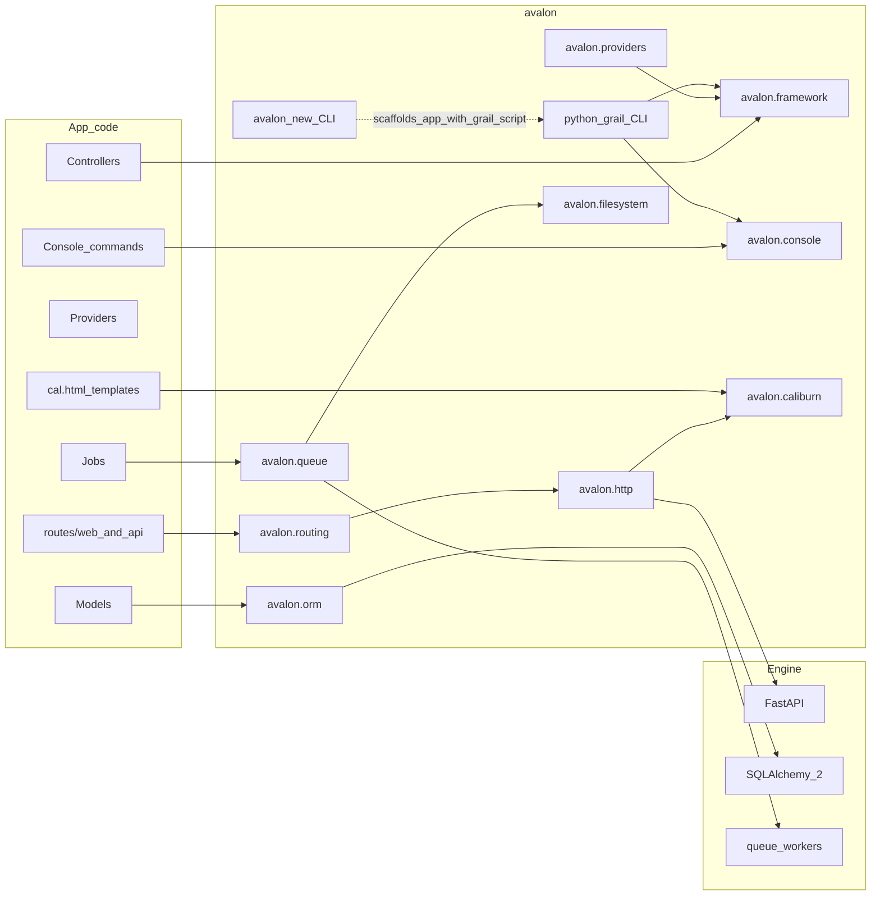

# Avalon — Canonical Plan

> **Status:** Binding. This document is the source of truth for architecture and milestones.
> Change it deliberately (PR / explicit decision), not casually mid-implementation.
> Last aligned: 2026-09-05 (M9 complete; post-M13 Digging Deeper + Articulate NoSQL queued).

## Working identity

- **Project / repo / distribution:** `avalon` (PyPI: `avalon`)
- **Import root:** `avalon` with intentional **subpackages**
- **CLIs (Laravel parallel):**
  - **`avalon new <app>`** — installer / project creator (like `laravel new`) — `avalon.installer`
  - **`python grail …`** — in-app commands via a root `grail` script (like `php artisan …`) — `avalon.grail`
  - Do **not** use Grail for project creation; do **not** use `avalon` for day-to-day app commands
- **HTTP engine:** FastAPI on Starlette (ASGI) — hidden behind Avalon’s programming model, with an escape hatch to the underlying FastAPI app for advanced cases
- **Validation / OpenAPI:** Pydantic v2 via Form Request–style classes
- **Views:** **Caliburn** (`avalon.caliburn`) — Blade-familiar syntax, featherweight render path, templates as **`.cal.html`**
- **Theme:** Arthurian naming for products/tools (`grail`, `Caliburn`); keep public APIs Laravel-familiar (`Route`, `Controller`, `Middleware`, `config()`, `@extends`)
- **App layout naming:** Python snake_case packages/modules (`app/models/post.py`); PascalCase **classes** and Laravel-shaped directory *roles* (`models`, `http/controllers`). See [Directory Structure](../website/src/content/docs/structure.md).

## Design picture (target DX)

Developers create apps with `avalon new`, then run `python grail …` inside the app (controllers, providers, `routes/`, `config/`). Avalon boots a service container, registers providers, compiles routes into FastAPI, and serves via Uvicorn. FastAPI/Starlette remain implementation details of the HTTP kernel. Views compile Caliburn templates (`.cal.html`) to fast Python callables.



## Package layout

```text
avalon/
  pyproject.toml
  src/avalon/
    framework/                 # Application, container, boot lifecycle
    config/                    # config repository, env
    providers/                 # core service providers + Provider base
    http/                      # kernel, request, response, middleware, controllers (+ M23 API Resources)
    routing/                   # Route DSL → FastAPI bridge
    validation/                # FormRequest
    translation/               # M4 — translator, plurals, Number, lang tooling
    grail/                     # in-app CLI entry (python grail …)
    exceptions/                # M8 — handler, debug page, error rendering
    log/                       # M8 — channels, log()
    console/                   # M9 — commands, scheduling
    filesystem/                # M10 — disks / FlySystem-shaped Storage
    queue/                     # M11 — jobs, workers, failed jobs
    mail/                      # M12 — Mailable, Mailer, transports
    notifications/             # M13 — Notifiable, channels (mail, database, …)
    support/                   # Collections (shipped); Helpers + Str (M14)
    cache/                     # M15 — Cache store + drivers
    redis/                     # M16 — Redis connection + session/cache/queue drivers
    encryption/                # M17 — Crypt façade
    events/                    # M18 — app event dispatcher (model events stay in orm)
    auth/                      # M7 (+ M19 Gates/Policies)
    client/                    # M20 — outbound HTTP client (inbound HTTP stays in http/)
    process/                   # M21 — Laravel Processes parity
    concurrency/               # M22 — concurrent closures / pools
    scout/                     # M27 — search (optional extra)
    broadcasting/              # M26 — Echo-class fan-out
    testing/                   # M28 — TestCase helpers beyond pytest baseline
    installer/                 # avalon new …
    orm/                       # M5 (+ M24 factories, M25 NoSQL/document stores)
    caliburn/                  # M6 — optional for API apps
    session/                   # M7 — session, CSRF, cookie encrypt
  tests/
  examples/
  docs/
```

**Import examples:**

- `from avalon.framework import Application`
- `from avalon.routing import Route`
- `from avalon.http import Controller, Middleware`
- `from avalon.providers import ServiceProvider`
- `from avalon.validation import FormRequest`
- `from avalon.translation import __, trans, trans_choice, Number, Lang`
- `from avalon.orm import Model`
- later: `from avalon.caliburn import ViewFactory`
- later: `from avalon.filesystem import Storage`
- later: `from avalon.queue import Job, dispatch`
- later: `from avalon.mail import Mail, Mailable`
- later: `from avalon.notifications import notify, Notifiable`
- later: `from avalon.support import collect, Str`  # Helpers/Str expand in M14
- later: `from avalon.cache import Cache`
- later: `from avalon.encryption import Crypt`
- later: `from avalon.events import Event, dispatch as event`
- `from avalon.auth import Gate, Policy`  # M19
- `from avalon.client import Http`  # M20
- later: `from avalon.process import Process`
- later: `from avalon.concurrency import Concurrency`
- `from avalon.exceptions import Handler`
- `from avalon.log import log`
- `from avalon.console import Command, schedule`

### Subpackage boundaries

| Subpackage | Responsibility |
| --- | --- |
| `avalon.framework` | Application, IoC container, boot |
| `avalon.config` | `.env`, config files, `config()` |
| `avalon.providers` | Provider base + framework providers |
| `avalon.http` | Kernel, request/response, middleware, base controller |
| `avalon.routing` | Route definitions, groups, compiling onto FastAPI |
| `avalon.validation` | FormRequest / validation errors |
| `avalon.translation` | Translator, `lang/` catalogs, `__()` / `trans()` / `trans_choice()`, namespaces, Number/date helpers, locale resolution (M4) |
| `avalon.grail` | In-app CLI entrypoint (`python grail …`) — thin Typer surface over console kernel |
| `avalon.exceptions` | Handler (`report`/`render`), debug page, error views (M8) — distinct from `avalon.http.exceptions`, which holds the `HttpException` classes |
| `avalon.log` | Log channels + `log()` helper (M8) |
| `avalon.console` | Command base, discovery, scheduler (M9) |
| `avalon.filesystem` | Disks, Storage façade, FlySystem-shaped drivers (M10) |
| `avalon.queue` | Jobs, queues, workers, failed-job handling (M11) |
| `avalon.mail` | Mailable, Mailer, transports, Markdown mail (M12) |
| `avalon.notifications` | Notifiable, notification channels, database notifications (M13) |
| `avalon.support` | Support `Collection` (shipped); Laravel Helpers + `Str` (M14) |
| `avalon.cache` | Cache store + drivers (M15) |
| `avalon.redis` | Redis connection manager + drivers for cache/session/queue (M16) |
| `avalon.encryption` | `Crypt` façade — encrypt/decrypt/serialize (M17); cookie encrypt already under `avalon.session` (M7) |
| `avalon.events` | Application event dispatcher / listeners / subscribers (M18) |
| `avalon.client` | Outbound HTTP client — `Http` façade, fakes, retry, pool (M20) |
| `avalon.installer` | Installer CLI (`avalon new`) |
| `avalon.orm` | Eloquent-like ORM (M5); model factories (M24); NoSQL / document-store drivers (M25) |
| `avalon.caliburn` | Caliburn compiler/runtime (M6) |
| `avalon.auth` | Guards, middleware (M7); Gates / Policies (M19) |

## Ecosystem growth

Start as **one installable `avalon`**. When Caliburn, kits, filesystem drivers, or queues get large:

1. **Same repo, optional extras** — e.g. `pip install avalon[caliburn]`, or
2. **Monorepo of distributions** still under the `avalon.*` namespace, plus starter-kit packages

Do **not** rename the project to `avalon_framework`. “Framework” is the `avalon.framework` subpackage.

**Rules:**

- Core happy path must not require Caliburn; API apps never import `avalon.caliburn`
- `avalon.caliburn` stays framework-light and dependency-thin; integrate via a view provider
- Starter kits and heavy subsystems stay out of the default import surface
- App code uses `avalon.*` only — no FastAPI imports on the happy path

## Decision: ORM (Eloquent-like)

**Chosen approach:** Eloquent-shaped **Active Record + Query Builder API** as `avalon.orm`, built on **SQLAlchemy 2.0 Core (async-first)**.

**Parity target:** full Eloquent parity — models, query builder, every relationship type, eager loading, collections, casts, accessors/mutators, scopes, soft deletes, events/observers, pagination, transactions, and migrations. **M5 shipped the ladder for all of these; the 2026-09-08 audit against the Laravel Database + Eloquent sections found the surface short of exhaust, so M40–M44 finish the contract.**

**Core over ORM (binding):** Avalon uses SQLAlchemy **Core** (expression language, dialects, pooling, async engine) and implements Active Record itself. SQLAlchemy's declarative/Session unit-of-work is deliberately **not** used — it contradicts Active Record semantics (identity map, flush ordering, detached instances) and would leak through the DX. This keeps `avalon.orm` in control of the model lifecycle.

**Async-first (binding):** Every query/persistence operation is awaited, because Avalon runs on ASGI:

```python
user = await User.query().where("email", email).first()
posts = await Post.query().with_("author", "comments").find(1)
published = await user.posts().where("published", True).get()
```

Sync Eloquent-style calls are **not** offered — a hidden sync bridge under async is a footgun, not DX.

**Internal rule:** App code depends on `avalon.orm`, not SQLAlchemy — except documented escape hatches (`DB.raw`, `DB.connection().execute`).

### Decision: Articulate multi-store (SQL + NoSQL) — binding for M25

M5 shipped the **SQL** Eloquent ladder on SQLAlchemy Core (exhaust scheduled as **M40–M44** after the 2026-09-08 audit). **NoSQL is not a second ORM and not a forever-Later extra** — it is a scheduled Articulate core track (**M25**) so document stores share the same Active Record mental model where semantics match, without pretending every SQL feature exists on Mongo.

**Why bake into Articulate (not a satellite package):** a bolt-on `avalon.mongo` that reimplements models/collections/events will fork the DX and force apps to learn two ORMs. Queuing NoSQL as Articulate work forces the connection/model boundary to stay honest while SQL remains the default happy path.

**Contract (binding when M25 lands; design constraint from now):**

| Concern | Rule |
| --- | --- |
| Package home | `avalon.orm` — same `Model` / `DB` / `Collection` import root; store-specific code behind connection drivers |
| Default | SQL connections stay the scaffold default; NoSQL is opt-in via `config/database.py` + extras (`avalon[mongo]`, …) |
| Connection | Every connection declares a **store kind** (`sql` \| `document` / driver name). Models bind to a connection (explicit or default) |
| Shared DX | Casts, accessors/mutators, dirty tracking, soft deletes (where meaningful), model events/observers, Support/Eloquent collections, pagination shapes — reuse when semantics are honest |
| Divergent DX | Schema builder / SQL migrations do **not** fake-map onto document collections; relationships are reference/embed (or driver-documented equivalents), not SQL join theater; query builder exposes only what the driver can honor |
| Escape hatches | Driver-native APIs behind documented façades (e.g. Mongo collection access) — never leak motor/pymongo types into happy-path app signatures |
| Exhaust rule | M25 exhausts **MongoDB** as the first document driver end-to-end (config → model → query → tests → docs). Other NoSQL (Cosmos API, Dynamo-shaped, …) may follow as additional drivers under the same store abstraction — do not claim them in M25 unless exhausted |
| Non-goals | Replacing SQL Articulate; dual-write magic; automatic SQL↔document sync; pretending `belongs_to_many` pivots exist on documents |

**Until M25:** do not add ad-hoc Mongo helpers outside this contract. SQL M5 APIs may keep evolving, but new Articulate internals should prefer connection/driver seams that M25 can plug into rather than hard-wiring SQLAlchemy types into every public path.

### Parity ladder (all in M5)

1. **Connections:** `config/database.py`, multiple connections, SQLite / PostgreSQL / MySQL+MariaDB / SQL Server (Laravel first-party set) plus optional Oracle, `DB` façade, raw queries, transactions (+ nested via savepoints)
2. **Model:** table/key inference, `fillable`/`guarded` + `MassAssignmentException`, `casts`, defaults, accessors/mutators, dirty tracking (`is_dirty` / `get_changes` / `get_original`), timestamps, `hidden`/`visible`/`appends`, `to_dict`/`to_json`, `save`/`update`/`delete`/`refresh`/`replicate`/`is_`
3. **Builder:** full `where` family (in / null / between / date parts / column / like / nested closures / or-variants), ordering, grouping + having, limit/offset, select + distinct + raw, joins, aggregates, `pluck`/`value`, `exists`, `find_or_fail`, `first_or_create`, `update_or_create`, `increment`/`decrement`, dialect-native `upsert` (SQLite/PG `ON CONFLICT`, MySQL `ON DUPLICATE KEY`; probe fallback otherwise), `chunk`/`cursor`/`each`, `when`/`unless`, `to_sql`
4. **Relationships:** `has_one`, `has_many`, `belongs_to`, `belongs_to_many` (pivot columns, `attach`/`detach`/`sync`/`toggle`), `has_one_through`, `has_many_through`, polymorphic (`morph_one`, `morph_many`, `morph_to`, `morph_to_many`, `morphed_by_many`)
5. **Eager loading:** `with_` (nested + constrained), `with_count`, lazy `load` / `load_missing`, `has` / `doesnt_have` / `where_has` / `where_doesnt_have`. **Attribute lazy-load is off by default** (unloaded `model.rel` raises). Opt in with `Model.lazy_relations = True` so `await model.rel` loads — still an explicit `await`, never hidden sync IO on attribute access.
6. **Collections:** Eloquent-shaped `Collection` returned from every multi-row read
7. **Scopes & lifecycle:** local scopes, global scopes, soft deletes (`trashed` / `with_trashed` / `only_trashed` / `restore` / `force_delete`), model events + observers
8. **Pagination:** `paginate` / `simple_paginate` with a JSON-serializable paginator
9. **Migrations:** Schema builder (`Schema.create` + `Blueprint`) over SQLAlchemy DDL; ordered Python migration files + a `migrations` table (not Alembic revisions); `make:model` (+`-m`), `make:migration` with Laravel TableGuesser name inference (create/update/blank stubs + StudlyCase class from slug), `migrate`, `migrate:rollback`, `migrate:fresh`, `migrate:status`. **Column modifiers (shipped):** chain on the creation line — `nullable()`, `default(...)`, `unique()`, **`index()`**, `primary()`, `after` / `before` (MySQL/MariaDB), `constrained()` — matching Laravel `$table->string('email')->index()`. Table-level `index([...])` / `unique([...])` also ship.
10. **Seeders:** `Seeder` with `call` / `call_with` / `call_silent` / `call_once` / `resolve` / invoke; `WithoutModelEvents`; `make:seeder`; `db:seed` / `migrate --seed` / `migrate:fresh --seed` (`--class` / `--seeder`); scaffold `DatabaseSeeder`. **Model factories are deferred to M24** — seeders must stay usable without them; factories later feed `DatabaseSeeder` the Laravel way (`User::factory()->count(10)->create()`).

**Rules:**

- N+1 must be *fixable*: eager loading is not optional polish, it ships with relationships.
- No SQLAlchemy types in app-facing signatures or return values.
- Mass assignment is guarded by default — `fillable` opt-in, never silently accept arbitrary input.
- Model events must fire for the documented lifecycle, including soft-delete restore.
- Migrations must round-trip: `migrate` → `migrate:rollback` returns the schema to its prior state.

**Deferred (declared, not M5):** database sessions/queue drivers (M11), model caching, read/write connection splitting, **model factories** (**M24**), and **NoSQL / document stores** (**M25** — Articulate multi-store; see decision above).

## Decision: Documentation site (`website/`)

App-facing docs live in Astro Starlight under [`website/`](../website/). `PLAN.md` / `SMOKE.md` stay contributor contracts in `docs/`.

**Keep in plan (not blocking product milestones forever, but Basics is blocking before M7 code):**

1. **Major-version docs** — publish and switch among major Avalon versions (e.g. `1.x` / `2.x`) from the docs site, Laravel-style. Exact mechanics TBD (Starlight versioning, separate versioned content trees, or a thin version switcher); the requirement is that readers can open docs for the major they run.
2. **Prologue** — a top-level sidebar group (Laravel “Prologue”) holding **Release Notes / Changelog**, **Upgrade Guide**, and related orientation pages, versioned with the docs set above.
3. Changelogs and upgrade guides are **first-class docs content**, not only GitHub Releases prose.
4. **The Basics** — Laravel’s “The Basics” sidebar is the reader’s mental map of the HTTP stack. Avalon must mirror that map (Avalon names where they differ). Empty Basics (only Middleware) is a **docs bug**, not a product gap for most of those topics.

Do not invent a second docs engine; extend the Starlight site.

### The Basics — Laravel map → Avalon (binding)

Mirror Laravel’s Basics **order and coverage**. Deep Caliburn how-tos stay in the **Caliburn** sidebar (like Laravel’s separate Blade section); Basics **Views** is the short entry + pointer.

| Laravel Basics | Avalon docs slug (target) | Code status | Docs action |
| --- | --- | --- | --- |
| Routing | `routing` | **Shipped (M2)** — `Route` DSL, groups, polarity | **Done** |
| Middleware | `middleware` | **Shipped (M2)** | **Done** |
| CSRF Protection | `csrf` | **Shipped (M7 foundation)** — `VerifyCsrfToken` + `@csrf` | **Done** |
| Controllers | `controllers` | **Shipped (M2/M3)** — base `Controller`, `make:controller`, DI | **Done** |
| Requests | `requests` | **Shipped (M2)** — `Request` bag | **Done** |
| Responses | `responses` | **Shipped (M2)** — `Response`, `html()`, JSON polarity | **Done** |
| Views | `views` | **Shipped (M6)** — `view()` / `ViewFactory` | **Done** — overview + link to Caliburn |
| Blade Templates | *(Caliburn section)* | **Shipped (M6)** | **Done** as Caliburn group (not duplicated under Basics) |
| Asset Bundling | `asset-bundling` | **Partial (M6)** — `asset()` / `@asset` + `public/` on `grail serve`; default `avalon new` ships **Vite + Tailwind** → `public/build`; Python core stays Node-free; starter kits may replace/extend | **Partial** — default scaffold + docs; full `@vite` helper follow-up |
| URL Generation | `urls` | **Partial (M3)** — `url()`, `asset()`, `redirect()`; named `route()` = **M33** | **Update with M33** |
| Session | `session` | **Shipped (M7 foundation)** — cookie driver, encrypt, flash | **Done** |
| Authentication | `authentication` | **Shipped (M7)** — guards, remember-me, events, docs | **Done** |
| Hashing | `hashing` | **Shipped (M7)** — bcrypt + optional argon2id | **Done** |
| Passwords | `passwords` | **Shipped (M7)** — broker + confirm; outbound mail **M12**/**M13** | **Done** |
| Validation | `validation` | **Shipped (M3)** — `FormRequest` | **Done** |
| Error Handling | `errors` | **Shipped (M8)** — Handler, polarity pages, publish | **Done** |
| Logging | `logging` | **Shipped (M8)** | **Done** |

**Starlight sidebar target for “The Basics”:**

```
The Basics
  Routing
  Middleware          # existing
  CSRF Protection     # M7 (placeholder OK until then)
  Controllers
  Requests
  Responses
  Views
  Asset Bundling
  URL Generation
  Session             # M7
  Validation
  Error Handling      # thin now / full M8
  Logging             # M8
```

Caliburn remains its own top-level group (Blade equivalent). Do **not** put the full Caliburn tutorial under Basics.

**Gate before starting M7 implementation:** Basics pages for shipped surfaces are published and linked in `website/astro.config.mjs` (**met**). Expand CSRF / Session / Logging placeholders when those milestones land — not fake APIs.

### Digging Deeper — scheduled surfaces (binding when milestones land)

Laravel’s Digging Deeper / Security / Packages clusters map onto Avalon as follows. Starlight sidebars grow when each surface ships — do not stub fake APIs ahead of the milestones.

| Laravel | Avalon docs slug (target) | Milestone | Docs action |
| --- | --- | --- | --- |
| Collections | `collections` | Support Collections, **M49** | **Done** — 155/155 methods, lazy collections, a section per method |
| Localization | `localization` | **M4** (code **Done**) | **Docs gap** — write Starlight Localization page (code already exhausted) |
| Helpers | `helpers` | **M14**, **M50** | **Done** — `Arr` 59, `Number` 20, the global helpers, a section per method |
| Strings | `strings` | **M14**, **M50** | **Done** — `Str` 91, `Stringable` 134 by delegation, a section per method |
| Cache | `cache` | **M15** | Shipped |
| Redis | `redis` | **Done (M16)** | Redis page + Cache/Session/Queues updates |
| Encryption | `encryption` | **M17** | `Crypt` façade, JSON-safe encrypt, `APP_PREVIOUS_KEYS`, `key:generate` |
| Events | `events` | **M18** | Write when app event dispatcher ships (model events already in Articulate) |
| Broadcasting | `broadcasting` | **M26** | Write when broadcasting ships |
| Authorization | `authorization` | **M19** | Write when Gates/Policies ship |
| HTTP Client | `http-client` | **M20** | Shipped |
| Processes | `processes` | **M21** | Write when Processes ship |
| Concurrency | `concurrency` | **M22** | Write when Concurrency ships |
| Eloquent: Mutators & Casting | `articulate/casts` | **Done (M40)** | Page published |
| Eloquent: Serialization | `articulate/serialization` | **Done (M40)** | Page published; API Resources stay M23 |
| Eloquent: API Resources | `eloquent-resources` / `api-resources` | **M23** | Write when Resources ship |
| Eloquent: Factories | `database/factories` | **M24** | Write when factories ship |
| MongoDB / NoSQL | `database/nosql` (+ Articulate pages) | **M25** | Write when document-store driver ships — core Articulate multi-store, not a satellite ORM |
| Scout / Search | `scout` / `search` | **M27** | Write when search ships |
| Queues | `queues` | **M11** | Write when queues ship |
| Mail | `mail` | **M12** | Write when mail ships |
| Notifications | `notifications` | **M13** | Write when notifications ship |
| Testing | `testing` (+ subpages) | **M28** | Write when testing toolkit expands |
| Packages | `packages` | **M29** | Write package-dev guidelines when that milestone lands |

Starlight **Digging Deeper** / **Security** / **Database** / **Packages** sidebars grow with those pages.

## Decision: Views — Caliburn

Caliburn is a **first-class view engine for Python**, not a thin wrapper around Jinja or FastAPI templates. **M6 exhausts full Laravel Blade parity** for the documented surface — the same exhaust rule as Articulate and localization. A partial “MVP forever” exit is not allowed.

| Item | Choice |
| --- | --- |
| Product name | Caliburn |
| Package | `avalon.caliburn` |
| Template extension | **`.cal.html`** |
| Inline code | **`@python` / `@endpython` only** (no freeform Python embedding) |
| DX north star | **Full Blade parity** — layouts, inheritance, components, slots, directives |
| Performance north star | **Featherweight** — first-class constraint |
| Docs | **Own Starlight section** (`website/…/caliburn/`) — thorough, Laravel Blade–shaped; write pages as surfaces ship |

Logic belongs in controllers, view models, and composers. `@python` is an escape hatch, not the default style.

### Parity target (binding)

Match Blade’s mental model end-to-end for app authors:

1. **Echo & comments** — `{{ }}` (escaped), `{!! !!}` (raw), `{{-- --}}`
2. **Layout inheritance** — `@extends`, `@section` / `@endsection` / `@show`, `@yield`, `@parent`, `@include` / `@includeIf` / `@includeWhen` / `@each`
3. **Control flow** — `@if` / `@elseif` / `@else` / `@unless` / `@isset` / `@empty` / `@auth` / `@guest` (auth wired when M7 exists; stubs/no-ops until then where needed), `@for` / `@foreach` / `@forelse` / `@while`, `@php` → **`@python` / `@endpython`**
4. **Components & slots** — class-based and anonymous components, `<x-name>` / `@component`, **slots** (`@slot`, `$slot`, named slots), attribute bags (`$attributes`), `@props`, `@aware`
5. **Stacks** — `@push` / `@prepend` / `@stack` / `@once`
6. **Framework directives** — `@csrf`, `@error`, `@lang` / `@choice` / `__()`, `@vite`-class asset helpers as `asset()` / `@asset` (subpath-aware from day one). **No Node dependency in Python core** — M6 owns URL helpers + `public/` serving for `grail serve`. Default `avalon new` (no starter kit) ships **Vite + Tailwind** scaffolding that emits into `public/build/`. Starter kits may replace or extend that toolchain. A first-class Caliburn `@vite` / hot-file helper is a follow-up on top of `asset()`.
7. **Extensibility** — `Engine.directive(...)` / service-provider registration for **custom `@directive`s**; app-owned Blade-style component libraries under `resources/views/components`
8. **Tooling** — `view()`, `ViewFactory`, compiled view cache, `grail view:clear` / `view:cache` when the console kernel can host them (M9); until then engine APIs + tests

**Rules:**

- Compile ahead, render thin — no re-lex/parse on the request hot path.
- XSS defaults match Blade: escape by default; raw is explicit.
- Caliburn templates are Avalon’s own (`.cal.html`), not “Jinja with Blade lipstick.”
- Do not claim M6 complete until the parity ladder below is exhausted **and** the Caliburn docs section covers it for app developers.

### Performance principles (non-negotiable)

- **Compile ahead, render thin** — no re-lex/parse on the request path
- **Aggressive compiled-cache** — mtime invalidate in dev; warm cache in prod
- **Minimal runtime** — thin dependency graph on the hot path
- **Zero-cost unused features**
- **Benchmark from day one** — echo, layout+sections, foreach, components; regression guards
- **Compare honestly** — Caliburn vs Jinja2 on shared fixtures

### Iteration ladder (exhaust inside M6)

1. **Layouts & echo:** `{{ }}`, `{!! !!}`, `@extends` / `@section` / `@yield` / `@parent`, `@include*` / `@each`, `{{-- --}}` — **shipped (advanced include variants)**
2. **Control flow:** `@if` family, `@isset` / `@empty(expr)`, `@foreach` / `@forelse` / `@for` / `@while`, `@auth` / `@guest` stubs, `@python` — **shipped**
3. **Components & slots:** `@component` / `<x-*>`, named + default slots, `<x-slot>`, attribute bags, `@props`, `@aware`, class-based `Component`, nested components
4. **Stacks + framework directives:** `@push` / `@stack`, `@lang` / `@choice` / `__()`, `@csrf` / `@error` / `@asset` stubs, asset helpers — **shipped (advanced surfaces)**
5. **Advanced:** composers, creators, fragment `@cache`, custom `Engine.directive`, `cache_views` / `clear_cache` — **shipped**

### Documentation (binding)

Ship a dedicated **Caliburn** sidebar group (peer to Articulate / Database), Laravel Blade–shaped topics, for example:

- Getting Started / Rendering Views
- Layouts & Inheritance
- Components & Slots
- Control Structures
- Including Subviews
- Stacks & Custom Directives
- Localization in views (`@lang` / `__`)

Pages land as each ladder rung ships — do not wait for M6 close to start the section.
## Decision: Scope discipline

Bite-sized milestones. **No** queues, notifications, scheduler, or mail until the **HTTP + validation + i18n + ORM + views + auth** core path is boring and tested (through M7). Seeders ship with M5 ORM; **model factories follow at M24**; **Articulate NoSQL / document stores at M25** (multi-store core — see ORM decision). Caliburn is its own track after the core gate. Error handling, console (incl. a Tinker-class REPL), filesystem, queues, **mail**, and **notifications** are sketched as **M8–M13**; Digging Deeper + Articulate follow-ons (helpers through packages, including NoSQL) are sketched as **M14–M29** so the roadmap is honest — they are not next work until their predecessors land. Multi-version docs + Prologue stay on the docs track (see Documentation site decision). **Localization docs** and **Articulate Mutators/Casts docs** are docs-track follow-ups on already-shipped M4/M5 code — they may land before M14.

**Localization is the one deliberate exception to “defer until needed.”** It sits at M4 because retrofitting translations across four message-producing layers costs far more than building them translatable. M4 exhausts **full Laravel localization parity** (not a thin core) — see the localization decision.

**Exhaust means full parity within the milestone’s declared scope.** Do not ship thin placeholders that claim a feature is done. Iterate inside the milestone (API + tests + living example) until the Laravel/Adonis-class DX for that slice is real, then move on. “Optional if light” / partial façades are not an exit criteria.

## Decision: Support Collections (`avalon.support`)

Laravel’s [`Illuminate\Support\Collection`](https://laravel.com/docs/collections) is **not** Eloquent’s model collection. Articulate already returns an Eloquent-shaped `Collection` from multi-row reads; Avalon also ships a first-class **Support** collection for general list/map work — `collect()` + fluent chains — matching Laravel’s Collections docs.

| Concern | Contract |
| --- | --- |
| Package | `avalon.support` — `Collection`, `collect()`, class helpers (`times`, `range`, `wrap`, `unwrap`, `make`) |
| Keys | Ordered-map semantics (list → contiguous int keys; dict keeps keys) |
| Returns | Transformers return **new** instances; `push` / `put` / `pop` / `pull` / `transform` match Laravel mutability |
| Macros | `Collection.macro(name, callback)` |
| Eloquent | `avalon.orm.collection.Collection` **extends** Support `Collection` (`load` / `load_missing` / `model_keys`) |
| Lazy | `LazyCollection` deferred until a streaming consumer needs it |
| Docs | Starlight **Collections** page (Support) + pointer from Articulate |

**Gate:** eager `Collection` exhausts the Laravel “Available Methods” list (skip Lazy / `dd` / `dump`); tests + docs green; Articulate regressions still pass. Can ship alongside M7 — does not block auth exhaust.

**Status (Collections):** Support `Collection` + `collect()` shipped — method surface (incl. `splice`, `multiply`, `reduce_spread`, assoc/using diffs & intersects, `to_pretty_json` / `from_json`), key-preserving filters, macros, Starlight **Collections** docs, `tests/test_support_collection.py`. Articulate `orm.Collection` extends Support.

**Correction (2026-09-08 audit):** the method surface is close but not closed, and the docs claim was too generous. 149 of the 155 methods on Laravel's Method Listing exist; `average`, `dd`, `dump`, and `lazy` do not. `LazyCollection` and higher-order messages (`collection.each.method()`) were never built, so Laravel's entire Lazy Collections section — including the `Enumerable` contract, `take_until_timeout`, `tap_each`, `throttle`, `remember`, and `with_heartbeat` — has no counterpart. The docs are the larger gap: Laravel gives each of the 155 methods its own section with an explanation and a runnable example (4,390 lines); Avalon's page is 140 lines built around a method-surface table. **M49** closes both.

## Decision: Production serving (ASGI)

Avalon apps are **plain ASGI**. There is no proprietary production server.

| Environment | How |
| --- | --- |
| Local | `python grail serve` → Uvicorn on `bootstrap.app:asgi` (dev reload; port walk 3000–3099) |
| Production | Uvicorn (or Gunicorn + Uvicorn workers / Hypercorn) on the same ASGI import path, behind a reverse proxy (Caddy / Nginx / Traefik) for TLS, compression, and optional static files |

**Rules:**

- App code never imports the process server; Grail/`uvicorn` are entrypoints only
- Production docs show workers + proxy; optional later: `python grail serve --workers N` (not required for M3)
- Static/asset CDN remains outside the Python process when possible; Avalon still generates correct public URLs (see subpath)

## Decision: Subpath hosting (first-class)

Laravel’s common failure mode — apps under `/apps/foo` with broken absolute `/…` assets and redirects — is **out of scope as a “proxy only” problem**. Avalon treats the public mount path as framework config.

| Config | Role |
| --- | --- |
| `APP_URL` | Canonical public origin (scheme + host[+port]), e.g. `https://example.com` |
| `APP_BASE_PATH` | Public path prefix, e.g. `/apps/foo` (empty or `/` = site root) |

**Contract (binding):**

1. **URL helpers** (`url()`, `route()`, `redirect()`, asset helpers) always honor `APP_BASE_PATH`
2. **Router / ASGI** either compile routes under the prefix or mount the ASGI app at it — one mechanism, documented; no double-prefix bugs
3. **Trusted proxies** (`X-Forwarded-Proto` / `Host` / `Prefix` as configured) so generated URLs match the public edge
4. **Caliburn asset helpers** (M6) must be prefix-aware from day one — never bake root-absolute asset paths that ignore `APP_BASE_PATH`

**Milestone homes:** design locked here; **M3 shipped URL generation** (`url()` / `asset()` / `redirect()`). **ASGI mount at `APP_BASE_PATH` ships with the HTTP kernel** — `grail serve` serves the app under the prefix and redirects `/` → `{base}/`. Caliburn asset helpers (M6) must stay prefix-aware; do not regress the mount.

## Decision: Route files — web vs api

Scaffolded apps ship **`routes/web.py`** and **`routes/api.py`**. They are not interchangeable dumps of the same handlers.

| File | Audience | Response | State | Middleware intent |
| --- | --- | --- | --- | --- |
| `routes/web.py` | Browsers | **HTML** (`text/html`) | **Stateful** (cookies / session once M7 exists) | Future `web` group: session, cookie encryption, CSRF |
| `routes/api.py` | Machines / SPAs / clients | **JSON** (`application/json`) | **Stateless** | Future `api` group: no session/CSRF; auth via token/bearer |

**Contract (binding; shipped in M2):**

1. Controllers registered in `web.py` return HTML (string / `html()` helper / later Caliburn `view()`). Do **not** default web routes to JSON dicts.
2. Controllers registered in `api.py` return JSON (dict/list / `json()`). Do **not** return HTML from API routes.
3. Framework does **not** auto-negotiate content type from `Accept` to paper over mixing the two files — put the route in the right file.
4. Stateful `web` means session + CSRF + encrypted cookies (M7); `api` stays bearer-only.
5. Until Caliburn (M6), web HTML may be hand-built strings via `html()` — still HTML, not JSON-as-HTML.
6. `HttpException` on API stays JSON `{message, status, errors?}`. On web, prefer HTML error pages once views exist; until then a minimal HTML error body is acceptable for web-only routes.

**Known boundary:** `avalon.http.Response` is currently Starlette's `Response` re-exported so controllers can annotate HTML actions without importing Starlette. App code still imports `avalon.*` only. An Avalon-owned response object is a candidate for a later DX pass — only if it earns its keep.

**Middleware groups (shipped):** `config/http.py` declares empty `middleware_groups` shells; **`bootstrap/app.py`** registers aliases and fills `web` / `api` via `Application.configure().with_middleware(...)`. Route files still reference groups by name (`Route.group(middleware=["web"])`). The kernel expands group names into their members before resolving aliases, recursively, and raises on circular references. **`web`** includes EncryptCookies, StartSession, VerifyCsrfToken, StartAuth; **`api`** stays without session/CSRF (StartAuth for bearer only). API throttling/CORS remain in the hardening pass.

**Living example rule:** Request-bag / verb demos that return structured data live under **`/api/…`**. Browser pages (`/`, progress board) live under **`web.py`** and render HTML.

## Decision: Router DX beyond core verbs

**M2 delivered:** `get` / `post` / `put` / `patch` / `delete` / `options` / `any` / `match`; per-route `middleware=` / `name=`; **`Route.group(prefix=, middleware=)`** as a context manager, **nestable** — prefixes concatenate and middleware accumulates outer→inner, stack pops on exit. Group middleware may name a **middleware group** (`web` / `api`) or an alias.

Group DX is deliberately **context-manager only**. Laravel's fluent `Route::middleware([...])->prefix(...)->group(...)` chain is not a goal; `with Route.group(...)` is the Pythonic shape and stays the one way to group.

`name=` is currently stored on `RouteDefinition` and passed to the engine, but nothing reads it back until the `route()` helper lands.

**Deferred (do not reopen M2):**

| Item | Home |
| --- | --- |
| `head`, `redirect` / `permanentRedirect`, `fallback`, named `route()` helper | Small DX pass after M3 (or end of M3 if `make:*` is light) |
| **Group options: `name=` (name prefixing), `controller=`, `domain=`, `where=` constraints, `without_middleware`** | Same post-M3 DX pass; `name=` should land with `route()` since they pair |
| `resource` / `apiResource` | **M33** |
| `view` routes | Caliburn (M6) |

## Decision: Security roadmap

M2 shipped the middleware **pipeline + group mechanism** only — `web` and `api` default stacks are empty. Security is **not** implied by M2.

| Concern | Approach | Milestone home |
| --- | --- | --- |
| Security headers (CSP baseline, `X-Frame-Options`, `Referrer-Policy`, etc.) | Default middleware pack; config knobs in `config/http.py` | After M3 / with web hardening — no session dependency |
| CORS | Config + middleware for API apps | Same hardening pass |
| CSRF | Token + session; Caliburn `@csrf` | With sessions (M7 or dedicated web-security slice immediately before/with M7) |
| Cookie signing / encryption | Session / cookie stack | M7 |
| XSS escaping | `{{ }}` escaped vs `{!! !!}` raw | Caliburn M6 |
| CSP nonces | Tied to view rendering | Caliburn M6 ladder (framework directives) |
| Trusted proxies | Request / URL generation | With subpath helpers |
| Rate limiting | Optional middleware | **M35** |
| `auth` / `guest` | Guards | M7 |

**Rules:**

- Do **not** ship CSRF theater without a real session store
- Default **web** middleware should be secure-by-default once the web stack exists; API scaffolds may omit CSRF
- Exhaust one milestone at a time — do not fold this whole table into M3

## Decision: Request capture (Laravel parity)

`avalon.http.Request` is the app-facing request type. Controllers must not need Starlette/FastAPI request types.

| Concern | Contract |
| --- | --- |
| Hydration | Kernel builds `Request` via `await Request.create(...)` once per request (query + JSON/form body + files) |
| `all()` / `input()` | Query **merged with** body; **body wins**; route params are **not** included |
| `query()` / `post()` / `json()` | Query-only, body-only, parsed JSON |
| `route()` | Path parameters |
| Selection | `only()`, `except_()` (Laravel `except`), `keys()`, `has`, `has_any`, `filled`, `missing` |
| Coercion | `boolean()`, `integer()`, `float()`, `string()` |
| Mutation | `merge()`, `replace()` (middleware-friendly) |
| Files | `UploadedFile`, `file()`, `files()`, `has_file()` |
| Meta | `method`, `path`, `url`, `headers`, `cookies`, `header()`, `cookie()`, `bearer_token()`, `ip()`, `user_agent()`, `is_method()`, `is_json()` |
| Controller injection | `Request` by type/name; route params by name; other type hints via container `make()` |
| Validation | **`FormRequest` (M3)** — not ad-hoc `$request->validate()` on the base Request for M2 exit |

**M2 is closed:** this table is implemented, tested, and exercised in `examples/progress`.

## Decision: Localization (i18n)

i18n is **infrastructure, not a feature bolted on late**. It lands as **M4**, immediately after validation and before ORM, views, auth, and error pages — so every layer that produces user-facing text is born translatable instead of being retrofitted four times.

**Parity target:** everything Laravel ships on its [Localization](https://laravel.com/docs/localization) page plus the `Lang` / `Translator` surface and the localization-adjacent Number / date helpers. M4 is **not** a thin core with follow-ups — exhaust Laravel parity inside the milestone.

**Why early (binding rationale):** at the end of M3 the framework owns roughly 25 English strings, all in `avalon.validation` plus a few exception defaults. That is the entire retrofit cost today. Every later milestone (Caliburn views, auth messages, M8 error pages) multiplies it.

**Catalog layout** (Laravel-shaped, app-owned `lang/`):

```text
lang/
  en/
    validation.py      # framework message overrides (app wins)
    auth.py
    passwords.py
    pagination.py
    messages.py        # app strings
  sw/
    validation.py
    messages.py
  en.json              # flat "string as key" catalog
  sw.json
  vendor/
    some_package/
      en/
        messages.py    # app override of a package catalog
```

Python files return a `dict` (nested ok). JSON files are flat `str → str`. Both forms are first-class.

**Contract — translator:**

| Concern | Contract |
| --- | --- |
| Helpers | `__()` / `trans()` — dotted `file.key` for PHP-style catalogs; literal string key for JSON catalogs |
| Choice | `trans_choice()` / `Lang.choice()` — pipe plurals (`one\|other`), interval forms (`{0} none\|[1,19] some\|[20,*] many`), and **CLDR plural categories** via Babel (zero/one/two/few/many/other per locale) |
| Placeholders | Laravel `:name` replacement; case transforms `:Name` / `:NAME` / `:NaMe` mirror Laravel |
| Count placeholder | `:count` auto-injected by `trans_choice` |
| Locale | `APP_LOCALE` + `APP_FALLBACK_LOCALE`; `app.set_locale()` / `get_locale()` / `is_locale()`; **request-scoped** under ASGI |
| Fallback | missing key → fallback locale → return the key itself (never exception, never blank) |
| Introspection | `Lang.has(key)`, `Lang.has_for_locale(key, locale)` |
| Namespaces | `package::file.key`; packages register via `Lang.add_namespace(name, path)` |
| Vendor overrides | `lang/vendor/<package>/<locale>/…` wins over the package's own catalog |
| Loader surface | `add_path`, `add_json_path`, `add_lines` (runtime lines), matching Laravel's loader API |
| Missing keys | `Lang.handle_missing_keys_using(callback)` — optional app hook; default still returns the key |
| Loading | Catalogs load once and cache; reload in debug / on explicit clear |
| Locale resolution | `SetLocale` middleware: explicit `set_locale()` wins, then request signal (`Accept-Language` for `api`; session/cookie once M7 exists for `web`), then config default |
| Framework messages | Shipped `en` catalogs for `validation` (+ stubs for `auth` / `passwords` / `pagination`); apps override per key without forking the framework |
| Validation retrofit | M3 422/403 envelope and English wording stay **byte-identical** for `en`; messages resolve through the translator thereafter |

**Contract — localization helpers (Laravel-adjacent, in scope):**

| Concern | Contract |
| --- | --- |
| Numbers | `Number.format` / `percentage` / `currency` / `file_size` / `for_humans` — locale-aware via Babel; mirrors `Illuminate\Support\Number` |
| Dates | Setting the app locale also sets the active date locale (Babel/pendulum or equivalent) so formatted dates follow `APP_LOCALE` unless overridden |

**Contract — tooling:**

| Concern | Contract |
| --- | --- |
| Publish | `python grail lang:publish` — scaffolds `lang/` and publishes framework catalogs (Laravel `lang:publish`) |
| Make | `python grail make:lang <locale>` — empty locale tree for a new language |
| Missing | `python grail lang:missing [--locale=xx]` — reports keys present in the fallback but absent in the target |

**Rules:**

- The active locale is **request-scoped**. A process-wide mutable locale is a concurrency bug under ASGI — do not ship one.
- Missing keys must degrade visibly (return the key), not silently render blank.
- Framework strings must be overridable by apps without vendoring the framework catalog.
- Pluralization must be **locale-correct**, not English one/other pretending to be universal — **Babel is a binding dependency** for CLDR plural rules and Number/date formatting.
- `lang:*` / `make:lang` ship on the existing thin Typer `grail` surface (same pattern as M3's `make:*`); they do **not** wait for the M9 console kernel.
- Do not invent features Laravel does not ship (gettext / `.po`, locale-prefixed `/en/…` URLs as framework core).
- Do not fold Caliburn directives, ORM, or auth *copy* into M4 — M4 owns the translator; later milestones **consume** it. Caliburn **must** ship `@lang` / `@choice` / `__()` in views as part of M6's exhaust, wired to this translator.

**Explicitly deferred (not Laravel core i18n):**

| Item | Home |
| --- | --- |
| `@lang` / `@choice` / `__()` Caliburn directives | **M6** — required consumer of M4; not optional |
| Session/cookie locale persistence for `web` | **M7** — once sessions exist; M4 ships `Accept-Language` + explicit set |
| Locale-prefixed URLs (`/en/…`) | Not Laravel core; community pattern only if demand appears later |
| gettext / `.po` interop | Not Laravel; out of scope |

## Decision: Error handling (exceptions + logging)

Exception handling is a **layer**, not a side effect of the HTTP kernel. It gets its own milestone (**M8**) rather than being smuggled into validation or auth work.

**Shipped in M2 (locked, do not regress):**

- `HttpException` subclasses with `{message, status, errors?}`
- Conversion happens **inside** the middleware pipeline, so route middleware decorates error responses
- Unhandled exceptions → 500; message hidden unless `APP_DEBUG`

That is the floor. It is deliberately not a handler layer: there is no app-level hook, no reporting, no HTML error pages, no logging.

**Contract for M8:**

| Concern | Contract |
| --- | --- |
| App handler | `app/Exceptions/Handler.py`, resolved from the container, overridable; framework default when absent |
| Split | `report(exc)` — logging/telemetry side; `render(request, exc)` — response side |
| Suppression | `dont_report` list; `reportable()` / `renderable()` registration hooks |
| Per-exception hooks | Exception classes may define their own `report()` / `render()` |
| Negotiation | **Follows route polarity, not `Accept` guessing** — web routes render HTML; api routes render the JSON envelope. A web route that sends `Accept: application/json` still gets HTML; put the route in `api.py` (or return JSON from the controller) if the client needs the envelope |
| Debug vs production | **Security gate is `APP_DEBUG` only** (not `APP_ENV`). `true` → rich debug page (traceback, source excerpts, request/route context) on **web**; `false` → production error views with a generic safe message. Api always uses the JSON envelope; debug only expands `message` (exception text / class), never dumps stack traces into JSON |
| Production pages | Resolve order: app `resources/views/errors/{status}.cal.html` → published/custom override → framework fallback (dependency-free HTML if Caliburn is unavailable). Cover at least `404`, `419`, `429`, `500`, `503` |
| Publish | `python grail errors:publish [--bundle=default\|tailwind\|bootstrap] [--force]` — copies a chosen set into `resources/views/errors/` for customization (Laravel `vendor:publish --tag=laravel-errors`). Scaffold / `avalon new` ships the **default** set; starter kits may pre-select Tailwind or Bootstrap |
| Bundle variants | Framework ships three **look** bundles under `avalon.exceptions` stubs: `default` (plain CSS, no toolchain), `tailwind`, `bootstrap`. Markup stays Caliburn; CSS/class conventions match the bundle. Core never depends on Node/Tailwind/Bootstrap — kits own compilation; published views assume the kit’s assets when non-default |
| Status mapping | Table mapping common framework/domain exceptions to HTTP status codes |
| JSON envelope | `{message, status, errors?}` is a **locked M2 contract** — M8 extends, never breaks it. Unhandled exceptions on api → `500` with that shape; validation stays `422` with `errors` |
| Logging | `config/logging.py`, channels (`stack`, `single`, `daily`, `stderr`), levels, context; `log()` helper; `report()` writes through it |

**Rules:**

- A debug page that leaks env/secrets when `APP_DEBUG` is false is a security bug — gate it on `APP_DEBUG` and test the gate (`APP_ENV=production` alone is not enough and must not re-enable the debug page)
- Do not ship `report()` without a real log destination; half a logging layer is exactly the placeholder this plan forbids
- Do not reopen M2 polarity for errors: no `Accept`-driven HTML↔JSON flip on the handler path
- Published error views are app-owned after `errors:publish`; framework fallbacks remain for apps that never publish
- Console-side exception rendering belongs to **M9** (console), not here
- Validation failures (M3) use the existing 422 envelope; M3 does **not** open the handler layer

## Milestones

### M0 — Skeleton — **complete**

- Repo/project `avalon`, installable distribution `avalon`
- Subpackage stubs: `framework`, `config`, `providers`, `http`, `routing`, `validation`, `grail`, `installer`, plus placeholders for `orm`, `caliburn`, `auth`
- Root `grail` script: `python grail version` works
- **`avalon new <name>`** scaffolds a Laravel-like app tree (incl. root `grail`, `bootstrap/app.py`, controllers, routes, config)
- **`python grail serve`** runs Uvicorn against `bootstrap.app:asgi` (M0 minimal FastAPI entry; Avalon HTTP kernel replaces this in M2)
- pytest harness + GitHub Actions CI (Python 3.11–3.13)
- Smoke plan: [`docs/SMOKE.md`](SMOKE.md); automated suite under `tests/smoke/`
- Coverage gate: **≥ 98%** on full `avalon` (`pytest-cov` in CI); **always aim for 100%**, especially on the package under the active milestone (Caliburn: `make test-cov-caliburn`).

### M1 — Application kernel — **complete**

- `Application.bootstrap()`: env → config → register providers → boot
- `.env` loader (`load_environment` / `env()`) and `ConfigRepository` + `config()`
- Service container: bind / singleton / instance / alias / resolve / `make` / constructor autowiring
- `ServiceProvider` + `FoundationServiceProvider`; `app.providers` from `config/app.py`
- Scaffolded apps boot the kernel from `bootstrap/app.py`
- Living example: [`examples/progress`](../examples/progress) (milestone board at `/progress`)
- Smoke: [`docs/SMOKE.md`](SMOKE.md) M1 section + `tests/smoke/test_m1_smoke.py`

### M2 — HTTP + routing — **complete**

- Router DSL: `Route.get/post/...`, nestable groups, prefixes, middleware aliases
- Controllers resolved from the container; async actions
- Middleware pipeline (`handle(request, next)`) with `config/http.py` defaults **and** Laravel 11-shaped registration in `bootstrap/app.py`: `Application.configure(...).with_middleware(...).create()` (`alias`, `web`/`api`/`group` append|prepend|replace, global `append`/`prepend`/`use`, **`trust_proxies` / `trust_hosts`**)
- `config/http.py` keeps empty group shells; app stacks, aliases, and proxy/host trust are registered in bootstrap (Progress demonstrates `demo.tag` this way)
- `HttpKernel` compiles Avalon routes onto FastAPI (engine stays hidden)
- **`Request` Laravel-parity input bag + controller capture** (see Decision above)
- `HttpException` JSON shape `{message, status, errors?}`, converted **inside** the pipeline so route middleware still decorates error responses
- **Route polarity:** `html()` + `Response` exported from `avalon.http`; scaffold ships HTML `routes/web.py` and JSON `routes/api.py`
- App bootstrap: `asgi = application.asgi` — **no FastAPI imports in app code**
- Smoke/regression: `tests/smoke/test_m2_smoke.py`, `tests/regression/test_m2_contracts.py`, `tests/test_m2_polarity.py`
- Living example: `/` + `/progress` render HTML; `/api/*` exhausts verbs, nested groups, Request bag, DI, exceptions

**Out of scope for M2 (unchanged):** production workers UX, `APP_BASE_PATH` mount, CSRF/CSP packs, `resource`/`view` routes, FormRequest, real sessions.

### M3 — Validation + DX — **complete**

- **`FormRequest`** on Pydantic v2: fields declared as annotations, schema built per subclass, `@field_validator` / `@model_validator` carried through
- Hooks: `authorize()` (false → 403), `prepare_for_validation()`, `passed_validation()`, `messages()`, `attributes()`, `validation_data()`
- Access: `data` (typed model), `validated(*keys)`, and proxying to the underlying `Request` for the full M2 input bag
- Kernel injects and validates before the action runs — invalid input never reaches controllers
- Laravel-shaped messages keyed by familiar rule names (`required`, `min`, `max`, `boolean`, `array`, `regex`, …), with string/collection size wording split as Laravel does
- Validation failures reuse the **locked 422 envelope** (`{message, status, errors}`) — M3 did **not** open the handler layer (that is M8)
- `python grail make:controller` / `make:middleware` / `make:provider` / `make:request` — nested namespaces, `__init__.py` creation, `--force`, duplicate + bad-name guards
- **URL generation:** `url()`, `asset()`, `redirect()`, `UrlGenerator` honoring `APP_URL` + `APP_BASE_PATH`; scaffolded apps and the living example use them for every link
- Living example: `POST /api/items` backed by `StoreItemRequest`
- Tests: `tests/test_m3_validation.py`, `test_m3_make.py`, `test_m3_urls.py`, `tests/smoke/test_m3_smoke.py`, `tests/regression/test_m3_contracts.py`

**Gate met:** example boots, routes, injects, validates, responds — no FastAPI imports in app code.

**Out of scope for M3:** exception handler layer + logging (M8), `route()` named-URL helper (post-M3 DX pass). ASGI mounting at `APP_BASE_PATH` is implemented on the HTTP kernel (see subpath decision).

### M4 — Localization (`avalon.translation`) — **complete**

Full Laravel localization parity before ORM/views/auth. See the decision above for the binding contract — M4 exhausts that contract, not a thin subset.

- `Translator` + `Lang` façade bound in the container; `__()` / `trans()` / `trans_choice()` exported from `avalon.translation`
- Catalog loading: `lang/<locale>/<file>.py` (nested dicts) + flat `lang/<locale>.json` (string-as-key); cached; `add_path` / `add_json_path` / `add_lines`
- Placeholders with Laravel case transforms (`:name` / `:Name` / `:NAME`); `:count` in choices
- Pluralization: pipe forms, interval forms (`{0}|[1,19]|[20,*]`), and **Babel CLDR** plural categories per locale
- Namespaces (`package::file.key`), vendor overrides (`lang/vendor/<package>/…`), `has` / `has_for_locale`, missing-key callback
- `APP_LOCALE` / `APP_FALLBACK_LOCALE`; `set_locale` / `get_locale` / `is_locale` — **request-scoped**
- `SetLocale` middleware (`Accept-Language` for `api`; explicit always wins)
- Localization helpers: `Number.format` / `percentage` / `currency` / `file_size` / `for_humans`; date locale follows app locale
- Tooling: `grail lang:publish`, `grail make:lang`, `grail lang:missing`
- **Retrofit:** `avalon.validation` messages resolve through the shipped `en` catalog (plus `auth` / `passwords` / `pagination` stubs); M3 422/403 envelope + `en` wording stay byte-identical
- Scaffold ships `lang/en/` + locale middleware; `avalon new` apps are translatable out of the box
- Living example: `/api/locale` answers in `en` / `sw` via `Accept-Language`

**Gate met:** dual-locale endpoint, CLI tooling, validation retrofit, coverage ≥ 95%.

### M5 — `avalon.orm` — **ladder shipped, pages not exhausted**

Eloquent-shaped Active Record on SQLAlchemy Core — see the ORM decision above for the binding ladder. M5 shipped the ladder and the mental model; a 2026-09-08 audit against Laravel's **Database** (6 pages) and **Eloquent** (7 pages) sections found the surface materially short of parity, so the exhaust work is scheduled as **M40–M44** and the earlier claim of "M5 exhausts it" is withdrawn.

- Connections + `DB` façade + transactions (savepoint nesting); `config/database.py` (SQLite / PostgreSQL / MySQL+MariaDB / SQL Server + optional Oracle)
- `Model` base: casts, accessors/mutators, mass-assignment guard, dirty tracking, timestamps, serialization
- Query builder: complete `where` family (canonical `where("col", "=", val)`, two-arg `=` shortcut), joins, aggregates, chunking, `upsert`, `to_sql`
- All relationship types incl. through + polymorphic; eager loading, `with_count`, `where_has`
- `Collection` return type; `paginate` / `simple_paginate`
- Local + global scopes, soft deletes, model events + observers
- Schema builder over SQLAlchemy DDL; Python migrator (`make:model`, `make:migration` with name inference, `migrate` / `rollback` / `fresh` / `status`) — not Alembic revisions. Column-line modifiers include **`->index()`** / `->unique()` (and table-level `index` / `unique`)
- Seeders: `Seeder` call API, `WithoutModelEvents`, `make:seeder`, `db:seed` / `migrate --seed` / `migrate:fresh --seed`, scaffold `DatabaseSeeder` (factories deferred — **M24**)
- Living example: `GET /api/orm` feature tour; `/api/posts` / `/api/users` cover eager load, scopes, soft deletes, pivot roles, morph comments, pagination, upsert
- Feature docs: [`website/…/articulate/`](../website/src/content/docs/articulate/) + [`database/`](../website/src/content/docs/database/)

**Gate met (M5 ladder):** models, relations, migrator, seeders, coverage ≥ 95%.

**Shipped since, by M40 (Articulate model exhaust):** modern casting (`Attribute` accessors, custom / inbound casts, `encrypted*`, `hashed`, enum collections, immutable-date aliases, per-attribute date formats, query-time casts); serialization controls (`append` / `merge_appends` / `set_appends` / `without_appends`, `merge_hidden` / `merge_visible`, `serialize_date`); Eloquent collection methods keyed by model (`find`, `fresh`, `to_query`, `only` / `except_` / `diff` / `intersect` / `unique`) and custom collection classes; UUID / ULID keys, strictness config, `unguarded`, `without_timestamps`, quiet writes, pruning + `model:prune`, streaming cursors and `lazy` / `chunk_by_id`.

**Still not exhausted — owed by M42–M44** (M41 closed the relationship items): query builder gaps (unions, pessimistic locking, JSON wheres, `where_exists` / subquery wheres, `where_not`, `where_any/all/none`, `where_time`, full-text, join subqueries, raw ordering/grouping, `insert_or_ignore`, `update_or_insert`, `increment_each`, `truncate`, `dd` / `dump` debugging); database layer gaps (read/write connections + sticky, query event listening, cumulative query-time monitoring, `DB.insert/update/delete/unprepared/scalar/pretend`, manual transactions, deadlock retries, `after_commit`, `db:show` / `db:table` / `db:monitor` / `db:wipe`); schema gaps (column alteration, `Schema.rename`, dropping indexes / foreign keys, schema inspection, ~25 column types, ~10 modifiers, `migrate:reset` / `migrate:refresh`, `--pretend` / `--step` / `--path` / `--force`, squashing); and pagination gaps (cursor pagination, URL-aware paginators, rendered link views).

### M6 — Caliburn (`avalon.caliburn`)

**Full Blade parity** — see the Views decision. M6 exhausts that ladder; it is a major product surface (a new Python view engine), not a stopgap.

- Compile-to-Python + mtime/warm cache; `view()` / `ViewFactory` via provider (`avalon[caliburn]` extra may stay empty while Caliburn is core)
- Layout inheritance, includes, control flow, **components & slots**, stacks, custom directives
- Replace hand-built web HTML in the living example with `.cal.html` (including componentized UI where it pays off)
- **i18n (required):** `@lang` / `@choice` / `__()` wired to `avalon.translation`
- **Docs (required):** dedicated Starlight **Caliburn** section — thorough how-tos, not a single stub page
- Benchmark suite from day one; continue parity without blocking auth
- **Subpath:** asset helpers + smoke under `APP_BASE_PATH`
- XSS defaults: escaped `{{ }}` vs raw `{!! !!}`
- **Tooling:** `grail make:component` (anonymous `.cal.html` under `resources/views/components`). Editor tooling — grammar, highlighting, snippets, formatter, directive completion — is **M45**, the Blade-equivalent IDE support; it waits until the directive vocabulary stops moving.
- **Assets:** `asset()` / `@asset` + serve `public/` in `grail serve`. Default scaffold ships Vite + Tailwind (`package.json`, `resources/css|js`, → `public/build`). Progress may keep plain CSS/JS under `public/` for the living demo while still carrying the default Vite tree for scaffold baseline parity. Full `@vite` directive is a follow-up.

**Gate:** ladder exhausted, Caliburn docs section covers shipped surfaces, progress example is Caliburn-first, coverage **100%** on `avalon.caliburn` (statements + branches on the M6 test suite). Real `@csrf` / `@auth` / `@guest` token wiring waits on M7 sessions; `grail view:*` CLI waits on M9 console kernel (engine `cache_views` / `clear_cache` APIs ship now).

### M7 — `avalon.auth`

**Parity target:** Laravel’s [Authentication](https://laravel.com/docs/authentication) + [Hashing](https://laravel.com/docs/hashing) + [Passwords](https://laravel.com/docs/passwords) documented surfaces — exhaust inside M7, same rule as M4/M5/M6. A thin “session cookie + middleware alias” exit is **not** allowed.

**In scope (framework core):**

| Ladder rung | Contract |
| --- | --- |
| Hashing | `Hash.make` / `check` / `needs_rehash` / `is_hashed` (bcrypt default; config-driven) |
| Contracts | `Authenticatable`, `UserProvider`; Articulate model provider |
| Config | `config/auth.py` — defaults, guards, providers, passwords brokers |
| Session guard | `attempt` / `validate` / `login` / `logout` / `login_using_id` / `once` / `once_using_id` / remember-me |
| Token guard | Classic API token lookup via user provider (stateless `api` guard) |
| Helpers | `auth()` manager; retrieve user / `check` / `guest` / `id` / `guard(name)` |
| Middleware | `auth` (optional `:guard`), `guest`, `password.confirm`, HTTP Basic |
| Password confirm | Session timestamp + `password.confirm` middleware |
| Password broker | Reset tokens table/API, `send_reset_link` / `reset` (delivery pluggable until **M12**/**M13**) |
| Catalogs | Wire `lang/en/auth.py` + `passwords.py` through attempts / broker statuses |
| Rehash | Automatic rehash on login when `needs_rehash` |
| Docs | Starlight **Authentication**, **Hashing**, **Passwords** (+ Session/CSRF already in Basics) |
| Living example | Progress: password column, `attempt()` login, protected route, bearer/token demo |

**Explicitly deferred (not M7):**

| Item | Home |
| --- | --- |
| Starter-kit auth UI (Breeze-class scaffolds) | Starter kits (**M36**) |
| Sanctum / Passport / Socialite | First-party packages (**M37**) |
| Authorization (Gates / Policies) | **M19** (Laravel’s separate Authorization docs) |
| Email verification | **M13** notifications (+ mail channel) |
| Real outbound reset mail | **M12** mail / **M13** notifications — broker + token API ships now |

**Gate:** ladder exhausted, Auth/Hashing/Passwords docs published, progress uses real credentials, coverage ≥ 98% (auth + hashing + passwords packages aim 100%).

**Status (M7):** Ladder shipped — session/CSRF/EncryptCookies; `Hash` (bcrypt + optional `argon2`/`argon2id`); session + token guards (`attempt`/`login`/`logout`/`once*`/`login_using_id`, remember-me **Set-Cookie**, rehash-on-login); `auth`/`guest`/`password.confirm`/`auth.basic`/`auth.start`; `Request.user()`; intended URL; auth events; `Password` broker (memory + optional DB table); catalogs; scaffold `config/auth.py` + `config/hashing.py`; Starlight Authentication/Hashing/Passwords; progress login + `/api/me`. **Deferred by design:** Sanctum/Passport/Socialite; Gates/Policies → **M19**; email verification → **M13**; outbound reset mail → **M12**/**M13**.

### M8 — Error handling (`avalon.exceptions` + `avalon.log`)

Turns M2's minimal kernel behavior into a real handler layer. See the decision above for the binding contract.

- `Handler` base in `avalon.exceptions`; app override at `app/Exceptions/Handler.py`, resolved from the container
- `report()` / `render()` split, `dont_report`, `reportable()` / `renderable()` hooks
- Per-exception `report()` / `render()` methods honored before the handler default
- **Polarity-aware rendering:** HTML for web, locked JSON envelope for api — **no** `Accept` flip
- `APP_DEBUG` web debug page (traceback, source excerpts, request/route context) with a test proving it is off when debug is false; api debug only widens `message`, never embeds a stack trace in JSON
- Production error views: `resources/views/errors/{status}.cal.html` + framework fallback; statuses at least `404` / `419` / `429` / `500` / `503`
- `python grail errors:publish [--bundle=default|tailwind|bootstrap] [--force]`; `avalon new` ships **default**; Tailwind/Bootstrap sets for kits / opt-in publish
- Logging slice: `config/logging.py`, channels (`stack`, `single`, `daily`, `stderr`), levels, context, `log()` helper
- Living example: a deliberate failure on a web route rendering HTML, the same failure on an api route rendering JSON

**Depends on:** M2 route polarity (done) and M6 Caliburn for error views. Do not start before M6 — HTML error pages without a view engine is exactly the placeholder trap.

**Status (M8):** Ladder shipped — `Handler` (`report`/`render`, hooks, `dont_report`); polarity-aware HTML vs JSON; unmatched-route path polarity; status mapping (`ModelNotFoundError` → 404, …); `APP_DEBUG` web debug page; production `errors/{status}` views + framework / Caliburn-off fallbacks; `errors:publish` (`default`/`tailwind`/`bootstrap`, CDN-free); `avalon.log` channels + `log().with_()` context; `lang/en/errors.py`; `ServiceUnavailableHttpException`; scaffold + progress `/boom` + `/api/explode`; smoke + Error Handling / Logging docs.

### M9 — Console + scheduler (`avalon.console`)

Grail today is a thin Typer entry (`version`, `serve`, `make:*`, `migrate`, …). M9 turns it into a Laravel-shaped **console kernel**.

- `Command` base: signature / help / `handle()`, IoC-resolved
- Command discovery: `app/Console/Commands`, `python grail list`, `python grail make:command`
- Framework commands stay in `avalon.console`; app commands register via provider or auto-discover
- Input / output helpers (arguments, options, tables, confirm) — exhaust the DX, not a stub Typer wrapper
- **Avalon Prompts** (`avalon.console.prompts`) — Laravel Prompts-class interactive UI: `text`, `textarea`, `password`, `number`, `confirm`, `select`, `multiselect`, `suggest`, `search`, `spin`, `progress`, `note`/`info`/`warning`/`error`/`alert`, with non-TTY / CI fallbacks; Command `ask` / `choice` / `secret` / `anticipate`
- **Scheduler:** `routes/console.py` or `app/Console/Kernel` schedule DSL (`daily`, `hourly`, `every_minute`, cron expressions)
- `python grail schedule:run` / `schedule:work` (long-running ticker) suitable for cron or a dedicated process
- Overlap / mutex for scheduled tasks (filesystem lock is enough until **M15** cache / **M16** Redis)
- Console-side rendering of uncaught exceptions, wired to the M8 handler
- **Interactive REPL (Tinker-class) — `python grail fiddle`** — user-friendly Python shell with the app booted (container, helpers, models, DB). Laravel parallel: `php artisan tinker`. Prefer **IPython** (`avalon[fiddle]` / `avalon[dev]`) with colored prompts + syntax highlighting; else ptpython; else Rich-enhanced fallback (never a bare undecorated `code.interact` without guidance). Boot `Application` once; pretty repr; history/completion when the preferred shell is available.
- Living example: at least one app command + one scheduled task + a smoke that the REPL boots and can resolve a model / run a trivial query

**Depends on:** solid Application boot (done); M8 for console exception rendering. Does **not** require queues — scheduled closures/commands run in-process; queue integration is M11. The REPL may land with M9 or as a fast follow once the console kernel exists — it must not be forgotten.

**Status (M9):** Ladder shipped, **page not exhausted** — the Artisan surface is finished in **M30** (one command surface, closure commands, `Artisan.call` / `queue`, isolatable commands, signal traps, console events, signature shortcuts / arrays / descriptions, stub publishing, missing built-ins) and the scheduler in **M31** (full frequency + hook vocabulary, `schedule:list` / `schedule:test`). What M9 delivered: `Command` base + discovery (`app/console/commands`, `avalon.console.commands`); `grail list` / `make:command` / `inspire`; schedule DSL (`every_minute` / `hourly` / `daily` / cron) + `schedule:run` / `schedule:work` + filesystem mutex; console exceptions report through M8 Handler; **`grail fiddle`** REPL (IPython preferred → ptpython → Rich fallback); **Avalon Prompts** (`avalon.console.prompts` — Laravel Prompts-shaped `text`/`select`/`confirm`/`spin`/`progress` + Command `ask`/`choice`/`secret`/`anticipate`); **`dump()` / `dd()`** (`avalon.debug` — Rich CLI + HTML/JSON HTTP dump pages); progress `progress:hello` / `progress:prompts` + `/dd` · `/api/dd` + `routes/console.py`; smoke + docs.

### M10 — Filesystem (`avalon.filesystem`)

FlySystem-shaped **Storage** façade — app code never talks to raw `pathlib` for “disk” operations on the happy path.

- `Storage.disk("local")` / `Storage.put` / `get` / `exists` / `delete` / `copy` / `move` / `url` / `temporary_url` (where driver supports)
- Drivers: **local** (required), **S3-compatible** (optional extra), memory (tests)
- Config: `config/filesystems.py` — default disk, roots under `storage/app`, public disk + symlink story (`python grail storage:link`)
- Stream / large-file friendly APIs; visibility (`public` / `private`)
- Integrate with existing `Request` uploads (`UploadedFile` → `Storage`)
- Provider + `storage()` helper; smoke against local disk

**Depends on:** M2 request files (done). Natural prerequisite for queue failed-job payloads and **M12** mail attachments.

**Status (M10):** Ladder exhausted — `Storage` / `storage()` / disks (`local`, `public`, `memory`, S3 via `avalon[s3]`); real `read_stream` / `write_stream` on local; visibility (+ chmod best-effort); `config/filesystems.py`; `storage:link`; UploadedFile `store` / `store_as` + `put_file` / `put_file_async`; **`temporary_url` raises on local/memory** (S3-only, Laravel-honest); provider; progress + docs + tests.

### M11 — Queues + job workers (`avalon.queue`)

- `Job` base: `handle()`, `dispatch()`, delay, tries, backoff, timeout
- `ShouldQueue` vs sync dispatch; `dispatch_sync` escape hatch
- Queue connection drivers: **database** (after M5) and/or **Redis** (**M16** driver); **sync** driver for tests/dev default
- `python grail queue:work` / `queue:listen` / `queue:retry` / `queue:failed`
- Failed jobs table/store + `failed()` hook on Job; failures report through the **M8** handler
- Middleware / job pipeline (rate limit, unique jobs — subset, exhaust what you claim)
- Horizon-class dashboard is **out of scope**; process supervision is docs (systemd / Docker)
- Living example: dispatch from a controller or command; worker processes the job

**Depends on:** M5 for database queue; M8 for failure reporting; M9 for `queue:*` commands; M10 nice-to-have for job artifacts.

**Unblocks:** queued mailables (M12) and queued notifications (M13).

**Status (M11):** Ladder exhausted — `Job` / `ShouldQueue` / `dispatch` / `dispatch_sync`; **`timeout` enforced** via `asyncio.wait_for`; sync + database drivers; `queue:work` / `listen` / `failed` / `retry`; middleware + unique id; living demo `progress:demo` / `ProgressDigestJob`; tests + Queues docs.

### M12 — Mail (`avalon.mail`)

**Parity target:** Laravel’s [Mail](https://laravel.com/docs/mail) documented surface — `Mailable`, `Mail` façade, transports, Markdown mailables. A thin “SMTP wrapper” exit is **not** allowed.

**In scope (framework core):**

| Ladder rung | Contract |
| --- | --- |
| Config | `config/mail.py` — default mailer, from address, transport settings |
| Mailable | Class-based messages: `envelope` / `content` / `attachments` (Laravel 9+ shape) or exhaust an equivalent fluent API |
| Mailer | `Mail.to(...).send(Mailable)` / `cc` / `bcc` / `send` / `queue` (queue when M11 exists; sync always) |
| Transports | **log** + **array** (tests/dev) + **SMTP** (production baseline); optional extras later (SES, Mailgun, …) as drivers behind the same API |
| Markdown mail | Caliburn/Markdown templates under `resources/views/mail` (or agreed path); themeable components |
| Attachments | From paths / `Storage` disks (M10) / raw bytes |
| Assertions | Test helpers: assert sent / not sent / queued (array driver) |
| Docs | Starlight **Mail** (Digging Deeper) |
| Living example | Progress (or mail-focused demo): send a welcome / password-reset mailable via log or SMTP in `.env` |

**Explicitly deferred (not M12):**

| Item | Home |
| --- | --- |
| Notification channels / `Notifiable` | **M13** |
| Email verification UX | **M13** (+ auth) |
| Broadcast / Slack / SMS channels | **M26** / first-party extras |
| Full third-party ESP kit matrix | Optional extras after SMTP baseline |

**Depends on:** M6 Caliburn for Markdown/HTML mail views; M10 for attachment disks (soft — path attachments can ship earlier); M11 for `ShouldQueue` mailables (sync send ships without waiting on workers).

**Gate:** ladder exhausted, Mail docs published, array/log drivers green in CI, SMTP documented, coverage ≥ 98% on `avalon.mail` (aim 100%).

**Status (M12):** Ladder exhausted — `Mailable` (`envelope` / `content` / `attachments`); `ShouldQueue` honored on `send()` via serializable `SendQueuedMailable`; `Mail.to(…).send/queue`; log + array + SMTP; Markdown themes (`mail.themes.default` + builtin fallback) + `<x-mail.*>` components; Storage/path/bytes attachments; `MailAssertions`; living `WelcomeMail` via `progress:demo`; tests + Mail docs.

### M13 — Notifications (`avalon.notifications`)

**Parity target:** Laravel’s [Notifications](https://laravel.com/docs/notifications) documented surface — `Notifiable`, notification classes, channels, database notifications. Closes M7 deferrals that need outbound delivery.

**In scope (framework core):**

| Ladder rung | Contract |
| --- | --- |
| Notifiable | Mixin/trait on models: `notify` / `notify_now` / route notification for mail |
| Notification | Class with `via(notifiable)` + channel builders (`to_mail`, `to_database`, …) |
| Channels | **mail** (M12), **database** (notifications table + Articulate), **log/array** for tests |
| Queue | `ShouldQueue` notifications when M11 exists; sync always available |
| Database UI data | Stored payload for in-app notification lists (no full SPA required) |
| Auth wiring | Password-reset delivery via notification/mail; **email verification** (`MustVerifyEmail`-shaped) |
| Docs | Starlight **Notifications** (+ update Passwords / Authentication for real delivery) |
| Living example | Progress: reset-password notification + verified-email flow (or equivalent demo) |

**Explicitly deferred (not M13):**

| Item | Home |
| --- | --- |
| Broadcast / Slack / SMS / push | **M26** / first-party packages |
| Notification inbox SPA | Starter kits / app code |
| Marketing drip / bulk mail | Outside framework core |

**Depends on:** M12 Mail (mail channel); M5 ORM (database channel); M7 auth (verification + reset consumers); M11 for queued notifications (optional for sync).

**Gate:** ladder exhausted, Notifications docs published, mail + database channels tested, password-reset outbound no longer pluggable-only theater, coverage ≥ 98% on `avalon.notifications` (aim 100%).

**Status (M13):** Ladder exhausted — `Notifiable` / `Notification` / channels (mail/database/log/array); `ShouldQueue` via serializable `SendQueuedNotification` (no double-send); `MustVerifyEmail` + **signed** verification URLs + **`verified` middleware** + progress `/email/verify*` routes; `ResetPasswordNotification` as password-broker default; Authentication + Passwords docs updated; living `progress:demo` notify path; progress `User` is Notifiable; tests + Notifications docs.

### M14 — Helpers + Strings (`avalon.support`)

Laravel [Helpers](https://laravel.com/docs/helpers) + [Strings](https://laravel.com/docs/strings) parity on top of the shipped Support `Collection`.

- Global / module helpers mirroring Laravel’s helper catalog that Avalon does not already own (`abort_if`, `blank`, `filled`, `data_get` / `data_set`, `value`, `tap`, `with_`, `optional`, `retry`, `throw_if`, …) — exhaust what you claim; skip PHP-only relics
- `Str` / `Stringable` fluent string API (`avalon.support.Str`) — `of`, `camel`, `snake`, `slug`, `limit`, `contains`, `replace_*`, `uuid`, … Laravel Strings surface
- Docs: Starlight **Helpers** + **Strings**; Collections page stays the collection-only entry
- Living example / tests for the helper surface used by scaffolded apps

**Depends on:** Support Collections (done). Natural early Digging Deeper milestone — does not require M10–M13.

**Gate:** claimed helper + `Str` surface exhausted, docs published, coverage ≥ 98% on new modules.

**Status (M14):** Ladder shipped — `Arr`, `Number`, `data_*` / misc helpers (`blank`, `tap`, `optional`, `retry`, `abort_if`, path helpers, …); `Str` / `Stringable` / `str_()`; Starlight Helpers + Strings; progress `progress:helpers`; tests + smoke.

**Correction (2026-09-08 audit):** "exhausted" was wrong — the ladder reaches every category, but no category is closed. Against the Laravel pages: `Str` has 80 of 87 methods, `Arr` 42 of 57, `Number` 17 of 20, and the fluent `Stringable` only 27 of 117, because it hand-writes its methods instead of delegating the whole `Str` surface. Of Laravel's ~65 global helpers, 37 exist somewhere in the package and 28 do not — some fairly (`broadcast`, `policy`, `context`, `fake` await their features) and some not (`request`, `response`, `session`, `cookie`, `logger`, `report`, `resolve`, `app`, `validator`, `old`, `back`, `bcrypt`, `method_field`, `csrf_field` all wrap surfaces that already ship). The URL family (`route`, `to_route`, `action`, `to_action`, `uri`, `secure_url`, `secure_asset`) belongs with named routes in **M33**. Docs are short the same way collections are: Laravel spends 3,787 lines on Helpers and 4,042 on Strings, a section per method; Avalon spends 154 and 180 on grouped tables. **M50** closes both.

**Closed (2026-09-08, M50):** `Str` 91, `Arr` 59, `Number` 20, and `Stringable` 134 by delegating the static surface rather than hand-writing it — and immutable now, as Laravel's is. The global helpers that wrap shipped surfaces exist; `broadcast`, `context`, and `fake` remain honestly absent, and the URL family is still **M33**'s. The pages are 2,980 and 3,260 lines, 377 sections, every example run before it was published.

### M15 — Cache (`avalon.cache`)

Laravel [Cache](https://laravel.com/docs/cache) store — first consumer of schedule mutex upgrades and queue unique locks.

- `Cache` façade: `get` / `put` / `forever` / `forget` / `flush` / `remember` / `remember_forever` / `add` / `pull` / `touch` / `many` / `put_many` / locks (`lock` / `block` / `restore_lock` / `flush_locks` / `without_overlapping`)
- Drivers: **array** (tests), **file**, **database** (M5); Redis driver lands with **M16**
- Atomic `add` on all stores; database locks via `cache_locks` table; file locks via `flock`
- Tags on **array** only (file/database raise — Laravel-honest); Redis tags in M16
- `config/cache.py`; `cache()` helper; `Cache.extend` for custom drivers
- Upgrade M9 schedule mutex to prefer cache locks when configured
- Docs: Starlight **Cache**

**Depends on:** M5 for database driver; M9 for scheduler consumer. Soft-depends on M10 for file paths under `storage/framework/cache`.

**Gate:** façade + array/file/database green; docs published; coverage ≥ 98%.

**Status (M15):** Ladder exhausted — `Cache` / `cache()`; array + file + database + null stores; atomic `add` / locks (`cache_locks`, file flock); tags on array only; `touch` / `restore_lock` / `flush_locks` / `extend`; schedule `without_overlapping` prefers cache locks; scaffold `config/cache.py`; progress `progress:cache`; Starlight Cache; tests + smoke.

### M16 — Redis (`avalon.redis` + drivers)

Laravel [Redis](https://laravel.com/docs/redis) connection manager and first-party drivers for session, cache, and queues.

- Redis connection / cluster config (`config/database.py` redis connections or `config/redis.py`)
- Drivers: **session** (M7 session stack), **cache** (M15), **queue** (M11) — opt-in via config; file/cookie/database remain defaults for local
- `Redis` façade for app-level get/set/pubsub primitives used by those drivers
- Docs: Starlight **Redis**; update Session / Cache / Queues pages for the Redis driver

**Depends on:** M7 session, M11 queues, M15 cache. Optional `avalon[redis]` extra.

**Gate:** at least one driver path proven end-to-end (cache or session); docs honest about extras; coverage ≥ 98% on Redis package.

**Status (M16):** Ladder exhausted — `Redis` / `redis()` façade; `config/redis.py`; `avalon[redis]` extra; Redis drivers for **cache** (tags + locks), **session**, and **queue**; Worker generalized beyond database; Starlight Redis; progress `progress:redis`; tests via FakeRedis (no server required in CI).

**Status (M17):** Ladder exhausted — `Crypt` / helpers; JSON-safe `encrypt`/`decrypt` (no pickle); `encrypt_string`/`decrypt_string`; `APP_PREVIOUS_KEYS` rotation; shared cipher with M7 cookie encrypt; `grail key:generate`; Starlight Encryption; progress `progress:encryption`.

### M18 — Events (`avalon.events`)

**Status (M18):** Ladder exhausted — `Event` / `event()` / `listen()`; dispatcher with wildcards + subscribers; queued listeners via `ShouldQueue` + `CallQueuedListener`; `ShouldBroadcast` stub (M26); `make:event` / `make:listener` / `event:list`; fakes; Starlight Events; progress `progress:events`.

### M19 — Authorization (`avalon.auth` Gates / Policies)

Laravel [Authorization](https://laravel.com/docs/authorization) — Gates and Policies (deferred from M7).

- `Gate::define` / `allows` / `denies` / `authorize` / `any` / `none`
- Policy classes + `make:policy`; auto-discovery; `Authorizable` on user
- Controller/`FormRequest` integration (`authorize` resource abilities)
- Caliburn `@can` / `@cannot` when views need them
- Docs: Starlight **Authorization** (Security sidebar)

**Depends on:** M7 auth (done); M6 for `@can` directives.

**Gate:** Gates + Policies exhausted, docs published, progress demo of a policy, coverage ≥ 98%.

**Status (M19):** Ladder exhausted — `Gate` / `gate()` / `authorize()`; policies + `Policy` / `HandlesAuthorization` / `AuthorizationResponse` (`deny_as_not_found` → 404); `before`/`after`; guest-safe signatures; `Authorizable` on `AuthenticatableMixin`; controller `authorize` / `authorizes_resource`; FormRequest bool or response; `can` middleware + `Route.can()`; Caliburn `@can` / `@cannot` / `@canany` / `@cannotany`; `grail make:policy`; Starlight Authorization; progress `progress:authorization`.

### M20 — HTTP Client

Laravel [HTTP Client](https://laravel.com/docs/http-client) — outbound fluent HTTP for apps and package code.

- `Http.get/post/…`, fluent headers/auth/timeout, JSON helpers, retry, pool
- Fake / sequence assertions for tests
- Async-friendly under ASGI (httpx or equivalent behind the façade)
- Docs: Starlight **HTTP Client**

**Depends on:** nothing hard; natural after core HTTP stack is boring.

**Gate:** façade + fakes green in CI, docs published, coverage ≥ 98%.

**Status (M20):** Ladder exhausted against every section of Laravel's HTTP Client page — `Http` façade mirroring `PendingRequest` (headers + `replace_headers`, `with_token` / basic / digest auth, RFC 6570 URL parameters, query parameters, cookies, timeouts, `as_json` / `as_form` / `as_multipart` / `body_format`, `with_body(content, content_type)`, `attach`, `sink`, `base_url`, request/response middleware, `before_sending`, `when` / `unless`, `truncate_exceptions_at`, `dump` / `dd`); `Response` (json / object / collect / status predicates / `throw*` / dict protocol); Laravel-shaped `retry` (max attempts, callable or list delays, `when` receiving a throwable plus the live request it may reconfigure, `throw`); `Http.pool` (named + indexed, `concurrency`, per-request customization, failures as values); `Http.batch` (`before` / `progress` / `then` / `catch` / `finally_`, `concurrency`, `defer`, inspection, `BatchInProgressException`); `Http.macro` / `flush_macros`; `RequestSending` / `ResponseReceived` / `ConnectionFailed` events; async verbs `aget` … `aoptions` on `httpx.AsyncClient`; fakes — URL maps with real fall-through for un-faked URLs, `Http.sequence` / `fake_sequence` (raising when drained, `when_empty` / `dont_fail_when_empty`), single-response + callable + exception stubs, `Http.failed_connection` / `failed_request`, `prevent_stray_requests` + `allow_stray_requests(patterns)`, `recorded()` request/response pairs and the `assert_sent*` / `assert_sequences_are_empty` family; `ClientServiceProvider`; Starlight HTTP Client; progress `progress:http`.

**Deliberate deviations (M20):** `RecordedRequest` exposes `url` / `method` / `headers` / `body` / `data` as attributes rather than PHP-style accessor methods; `Batch.finally_` carries a trailing underscore because `finally` is a Python keyword; `Batch.defer()` runs on a background thread (Avalon has no post-response deferral hook yet) and adds `wait()`; async verbs (`aget` …) have no Laravel counterpart. Guzzle-specific surface (`withMiddleware` on PSR-7 objects, `withOptions` keys) maps onto httpx equivalents.

### M21 — Processes

Laravel [Processes](https://laravel.com/docs/processes) — first-class subprocess DX.

- `Process::run` / `start` / `pool` / `concurrently`; timeouts; input/output; fake for tests
- Docs: Starlight **Processes**

**Depends on:** console/testing helpers nice-to-have; otherwise independent.

**Gate:** claimed surface exhausted, fakes work, docs published.

### M22 — Concurrency

Laravel [Concurrency](https://laravel.com/docs/concurrency) — run closures concurrently and collect results.

- `Concurrency::run([...])` (async tasks / process driver as appropriate under ASGI)
- Docs: Starlight **Concurrency**

**Depends on:** M21 Processes if process driver is claimed; otherwise asyncio-only driver first.

**Gate:** documented drivers work; docs published.

### M23 — API Resources + Serialization

Laravel [Eloquent API Resources](https://laravel.com/docs/eloquent-resources) + deeper [serialization](https://laravel.com/docs/eloquent-serialization) docs/DX.

- `JsonResource` / `ResourceCollection`; `to_array` / `with_` / `additional`; conditional attributes
- `make:resource`; wrap / pagination awareness
- Articulate serialization docs: `hidden` / `visible` / `appends` / `to_dict` / `to_json` / date serialization (code largely M5 — exhaust docs + any gaps)
- Docs: **API Resources** + Articulate **Serialization**

**Depends on:** M5 ORM (done); API route polarity (done).

**Gate:** Resources usable on `routes/api.py`, docs published, coverage ≥ 98%.

### M24 — Model factories

Eloquent/Laravel Factory parity — primary consumer is **seeders**.

- `Factory` base, `definition()` / states / sequences, `make:factory`, `Model.factory()`, `create` / `make` / `count` / relationships
- Wire `DatabaseSeeder` demos to factories the Laravel way
- Docs: Database **Factories** (+ seeding page update)

**Depends on:** M5 seeders (done). Homes after Articulate is boring in real apps.

**Gate:** factory → seeder path green in progress/example, docs published, coverage ≥ 98%.

### M25 — Articulate NoSQL / document stores

Bake **document stores into Articulate core** under the multi-store contract (see ORM decision above) — first driver **MongoDB**, same `avalon.orm` DX where semantics match.

- Connection store kinds in `config/database.py`; Mongo connection + `avalon[mongo]` extra (Motor/pymongo behind the driver — never in app signatures)
- Document `Model` path: collection naming, `_id` / key inference, casts, accessors/mutators, dirty tracking, soft deletes (where meaningful), model events/observers
- Query builder subset the driver can honor (`where` family, ordering, limit, aggregates that Mongo supports); honest errors for SQL-only APIs
- Relationships: references + embeds (document-native); do **not** fake SQL pivots/joins
- Schema story: collection indexes / setup commands — **not** SQL Blueprint theater mapped onto BSON
- Factories (M24) and seeders work against document models once M25 lands (or soft-depend: document factory support in this milestone)
- Living example: Progress (or dedicated demo) reading/writing a Mongo-backed model alongside SQL
- Docs: Database **NoSQL** / Articulate document-store pages; update Getting Started to show store kinds

**Depends on:** M5 SQL Articulate (done). Prefer after **M24** factories so seed/factory demos can cover both stores; may start design seams earlier without claiming exhaust.

**Gate:** Mongo driver exhausted end-to-end (config → model → query → tests → docs); SQL regressions still green; coverage ≥ 98% on new driver code (aim 100%). Other NoSQL engines are follow-on drivers under the same abstraction — not claimed unless exhausted here.

### M26 — Broadcasting

Laravel [Broadcasting](https://laravel.com/docs/broadcasting) — Echo-class / websocket fan-out (deferred from M13 notification channels).

- Broadcaster drivers (log/null + one real driver — Redis pub/sub or websocket bridge); `ShouldBroadcast` events
- Channel auth; client contract documented (Echo-shaped JS lives in starter kits)
- Docs: Starlight **Broadcasting**

**Depends on:** M18 Events; M16 Redis nice-to-have for Redis broadcaster.

**Gate:** at least null/log + one real path; docs published. Horizon-class UI out of scope.

### M27 — Search

Laravel Scout-class full-text search for Articulate models.

- `Searchable` model mixin; sync / queue indexing; driver abstraction (collection/array for tests; Meilisearch / Typesense / similar as extras)
- `grail scout:*` (or `search:*`) commands when useful
- Docs: Starlight **Search** / Scout equivalent

**Depends on:** M5 ORM; M11 for queued syncing (optional); document models (**M25**) should be searchable under the same mixin when honest.

**Gate:** one driver path + fakes; docs published. Heavy engines stay optional extras.

### M28 — Testing toolkit

Expand beyond the current pytest + smoke/regression baseline toward Laravel’s [Testing](https://laravel.com/docs/testing) map.

- HTTP tests: `AvalonTestCase` / async client helpers (`get`/`post`, assert status/json/session/auth)
- Console tests: `grail` command assertions (exit code, output)
- Mocking: façade fakes (Mail, Notification, Queue, Event, Http, Process) consolidated
- Browser tests: Playwright/Selenium-class optional extra — document honestly; not required in core CI
- Docs: Starlight **Testing** (+ HTTP / Console / Mocking subpages)

**Depends on:** surfaces being faked (M11–M13, M18, M20, M21). Can grow incrementally; this milestone exhausts the documented toolkit.

**Gate:** HTTP + console helpers used by framework tests themselves; docs published.

### M29 — Package development

Laravel [Package Development](https://laravel.com/docs/packages) guidelines for first-party and community packages.

- Service provider discovery / scaffolding; `lang` / `config` / `views` publish tags
- Naming, extras, testing expectations; `avalon` namespace vs third-party prefixes
- Docs: Starlight **Package Development** (Packages / Prologue-adjacent)
- Optional: `grail make:package` stub — only if it earns its keep

**Depends on:** providers + lang namespaces (done); Caliburn/view publish patterns useful.

**Gate:** guidelines published and followed by at least one in-repo optional package or documented example.

### M30 — Grail Console exhaust (Artisan parity)

Laravel [Artisan Console](https://laravel.com/docs/artisan) — M9 shipped the ladder (`Command` base, discovery, prompts, REPL, scheduler seed) but did **not** exhaust the page. M30 closes it and unifies the two console surfaces.

- **One command surface:** migrate the ~28 hard-coded Typer callbacks in `avalon/grail/cli.py` to `Command` classes so signatures, events, isolation, `Artisan.call`, and test helpers apply uniformly. Typer stays the argv front door only.
- **Signature parser:** option shortcuts (`{--Q|queue=}`), input arrays (`{user*}`, `{--id=*}`), argument/option descriptions (`{user : The user ID}`) feeding `grail help`
- **Command surface:** exit-code constants (`SUCCESS` / `FAILURE` / `INVALID`), `fail()`, `arguments()` / `options()`, `question()` / `alert()` / `new_line()`, progress bars on the command (`with_progress_bar`), `choice(multiple=…)`
- **Prompting for missing input:** `PromptsForMissingInput`-class hook + `prompt_for_missing_arguments_using` (dogfoods M9 prompts)
- **Closure commands:** `Artisan.command("mail:send {user}", callback)` in `routes/console.py` with `purpose()` descriptions and container-resolved parameters
- **Programmatic execution:** `Artisan` façade — `call` (dict or string argv, array/bool values), `output`, `queue` (→ M11), plus `self.call` / `self.call_silently` between commands
- **Isolatable commands:** `--isolated` with lock id / expiry, sharing the M15 cache lock and the M9 filesystem mutex fallback
- **Signal handling:** `trap(SIGTERM, …)` (single + multiple signals), honored by long-running commands (`queue:work`, `schedule:work`, `serve`)
- **Events:** `CommandStarting` / `CommandFinished` (+ a startup event) through the M18 dispatcher
- **Stub customization:** move generator stubs out of inline f-strings into a real stub set + `grail stub:publish`; app stubs override framework stubs
- **Missing built-ins** (only where the underlying feature exists): `about`, `help`, `route:list`, `config:show`, `db:wipe`, `db:show`/`db:table`, `queue:restart` / `queue:clear` / `queue:monitor`, `env:encrypt` / `env:decrypt`, `optimize` / `optimize:clear` + `config:cache` / `view:cache` and their `:clear` pairs (cache targets may land with M31/M15 work), `vendor:publish`, and the `make:*` set for shipped features (`make:job`, `make:mail`, `make:notification`, `make:rule`, `make:cast`, `make:exception`, `make:view`, `make:class`, `make:enum`, `make:interface`, `make:observer`). Generators for unshipped features stay with their milestone (`make:factory` → M24, `make:test` → M28, `make:resource` → M23, `make:channel` → M26).
- **Discovery is all-or-nothing:** one command file that fails to import aborts discovery for the whole directory, and the notice only prints on `grail list` — invoking a command shows "No such command" with no hint why. Report the failing module, keep the rest, and say so on every run
- **Fiddle allow-list:** Tinker-class `commands` / `dont_alias` configuration for the REPL
- Docs: rewrite Starlight **Grail Console** to the Artisan section order; document every built-in command
- Living example: progress app gains a closure command, an isolatable command, and a signal-trapping worker demo

**Depends on:** M9 (base), M11 (queueing commands), M15 cache (isolation locks), M18 (events). Console **test** helpers land with M28 and must be able to drive everything M30 adds.

**Gate:** every section of Laravel's Artisan page either implemented or listed as a deliberate deviation with a reason; one command surface (no command reachable only through Typer); `avalon.console` + `avalon.grail` at 100% coverage; docs published.

**Status (M30):** *In progress — the command layer has landed; the surface merge and command catalogue have not.*

- **Shipped:** signature parser (option shortcuts `{--Q|queue=}`, argument/option arrays, `:` descriptions, argv terminator `--`); exit-code constants + `fail()`; `arguments()` / `options()` / `has_option()`; `question` / `alert` / `new_line` / `with_progress_bar` / `choice(multiple=…)`; `PromptsForMissingInput`; closure commands via `Artisan.command(...).purpose(...)` in `routes/console.py` with container-resolved parameters; `Artisan.call` / `call_silently` / `output` / `queue` / `has` / `all` and `self.call` / `self.call_silently`; `Isolatable` + `--isolated[=CODE]` on cache lock with mutex fallback; `trap()` signal handling; `ConsoleStarting` / `CommandStarting` / `CommandFinished`; `CommandNotFound` / `CommandFailed`. Progress gains `progress:console`, `progress:import`, and a `progress:greet` closure command.
- **Remaining:** migrate the Typer callbacks in `avalon/grail/cli.py` to `Command` classes (one surface); stub tree + `grail stub:publish`; the missing built-in commands; Fiddle allow-list; the full docs rewrite in Artisan section order.

### M31 — Task Scheduling exhaust

Laravel [Task Scheduling](https://laravel.com/docs/scheduling) — M9 shipped a 5-frequency DSL. The 2026-09-08 audit put it at **8 of the 82 methods** the Laravel page documents: `call`, `command`, `cron`, `every_minute`, `every_five_minutes`, `hourly`, `daily`, `weekdays`, `weekends`, and `without_overlapping`. This is the thinnest surface in the framework relative to its page.

- **Frequency vocabulary:** `every_two_minutes` … `every_thirty_minutes` and `every_four_minutes`; `hourly_at`, `every_two_hours` / `every_three_hours` / `every_four_hours` / `every_six_hours` / `every_odd_hour`; `daily_at`, `twice_daily`, `twice_daily_at`; `weekly` / `weekly_on`; `monthly` / `monthly_on` / `twice_monthly` / `last_day_of_month`; `quarterly` / `quarterly_on`; `yearly` / `yearly_on`; `days`, `days_of_month`, `at`
- **Sub-minute:** `every_second` / `every_two_seconds` / `every_five_seconds` / `every_ten_seconds` / `every_fifteen_seconds` / `every_twenty_seconds` / `every_thirty_seconds`, the long-running `schedule:run` loop they require, and `schedule:interrupt`
- **Day constraints:** `mondays` … `sundays` as named methods alongside the existing `weekdays` / `weekends`
- **Constraints:** `between` / `unless_between`, `when` / `skip`, `environments`, `even_in_maintenance_mode`, `timezone`
- **Hooks:** `before` / `after` / `on_success` / `on_failure`, and the ping family `ping_before` / `ping_before_if` / `then_ping` / `then_ping_if` / `ping_on_success` / `ping_on_success_if` / `ping_on_failure` / `ping_on_failure_if`
- **Execution modes:** `run_in_background`, `on_one_server` (cache lock) with `name` / `purpose` for lock identity, `without_overlapping` expiry, `group` for shared attributes, job scheduling (`schedule.job(...)` → M11) and shell tasks (`schedule.exec(...)` → M21)
- **Output handling:** `send_output_to` / `append_output_to`, `email_output_to` / `email_output_on_failure` (→ M12)
- **Events:** the scheduled-task lifecycle events Laravel dispatches, on Avalon's event bus
- **Commands:** `schedule:list`, `schedule:test`, `schedule:work`, `schedule:interrupt`, `schedule:clear-cache`, and a documented `schedule:work` vs cron story
- **Docs:** rewrite Starlight **Task Scheduling** — 55 lines today against Laravel's 635, missing sub-minute tasks, groups, output, hooks, maintenance mode, environments, and events entirely. Follow the Laravel section order.

**Depends on:** M30 (command surface), M11 (queued jobs), M15/M16 (locks), M12 (output email), M21 (shell tasks).

**Gate:** frequency, constraint, hook, and output vocabulary exhausted against the Laravel page or the deviation named; `schedule:list` proves the registry; sub-minute tasks demonstrated end to end; docs published in the Laravel section order.

### M32 — Installer + scaffold stacks (`avalon new`)

Laravel [Installation](https://laravel.com/docs/installation) — `laravel new` is interactive; `avalon new` currently takes only a name and `--path`.

- **Interactive install** built on M9 prompts: stack, database, test runner, git init, dependency install, migrations — with `--no-interaction` and an explicit flag for every prompt so CI stays scriptable
- **Stack choice** (beyond Laravel, which is Tailwind-only): `tailwind` (default), `bootstrap`, `plain` CSS, and `none` — a zero-Node, server-rendered Caliburn app. Stack selection also picks the `errors:publish` bundle so error pages match the chosen CSS.
- **Database choice:** SQLite (default, with the file created) / Postgres / MySQL / MariaDB, writing the matching `.env` + `config/database.py` and offering to run migrations
- **Restructured scaffold:** replace the flat inlined `path -> content` dict in `avalon/installer/scaffold.py` with a parameterized stub tree shared with M30's `stub:publish`
- Post-create ergonomics: git init (`--git`, `--branch`), optional `uv` / `pip` install, `npm install && npm run build` when a Node stack is chosen, and next-step output that matches what was actually installed
- Docs: rewrite Starlight **Installation** with the prompt walkthrough and every flag

**Depends on:** M9 prompts (done), M30 stub tree. Starter kits are **M36**, not this milestone.

**Gate:** every prompt has a flag and a documented non-interactive default; each stack produces a booting app proven by smoke tests; docs published.

### M33 — Routing DX + named routes

Completes Laravel [Routing](https://laravel.com/docs/routing) and [URL Generation](https://laravel.com/docs/urls) (previously "Later"; URL Generation has been **Partial** since M3).

- Verb + shape sugar: `head`, `redirect` / `permanent_redirect`, `fallback`, `match`, `any`
- **Named routes** end to end: `name()` on routes and groups, `route()` / `RouteFacade.has`, signed URLs, and `route()` inside Caliburn
- Resource routing: `resource` / `api_resource`, `only` / `except`, shallow nesting, `resources` plural registration, and the `make:controller --resource` pairing
- `route:list` gains name / middleware columns (M30 ships the command)
- Docs: update Starlight **Routing** + **URL Generation**

**Depends on:** M2/M3 (done), M30 for `route:list`.

**Gate:** named routes usable from routes, controllers, redirects, and templates; resource routing exhausted; docs updated.

### M34 — Security headers + CORS

Post-M3 hardening pack, secure-by-default for the web stack.

- Header middleware (CSP with nonce support, HSTS, `X-Content-Type-Options`, referrer + permissions policy), configurable per group
- CORS middleware + `config/cors.py`, sensible API defaults
- Default web / API middleware stacks updated; scaffold ships them enabled
- Docs: Starlight **Security headers & CORS**

**Depends on:** M2 middleware (done), M7 web stack (done).

**Gate:** defaults on in the scaffold, documented opt-outs, smoke asserts the headers.

### M35 — Rate limiting

Laravel [Rate Limiting](https://laravel.com/docs/rate-limiting) — the cache-backed limiter plus the `throttle` middleware.

- `RateLimiter` façade (`attempt`, `too_many_attempts`, `remaining`, `available_in`, `clear`) on M15 cache
- `throttle` middleware with named limiters, per-user / per-IP keys, `Retry-After` + `X-RateLimit-*` headers
- Login throttling wired into M7 auth; queue/worker friendliness documented
- Docs: Starlight **Rate Limiting**

**Depends on:** M15 cache (locks/counters), M16 Redis for the production driver.

**Gate:** limiter + middleware + auth throttling shipped with fakes; docs published.

### M36 — Starter kits

Laravel [Starter Kits](https://laravel.com/docs/starter-kits) — opt-in application kits on top of the M32 scaffolder.

- **Web kit:** Caliburn auth UI (register / login / password reset / verify / profile) honoring the chosen M32 CSS stack
- **API kit:** JSON-polarity routes, token auth (pairs with M37), no session/CSRF middleware
- **SPA kit:** Vue / React front end over an Inertia-class bridge (server-side adapter + client package), the one stack M32 deliberately defers
- Selected by `avalon new` prompt / flag; each kit is a stub overlay, not a fork of the scaffold
- Docs: Starlight **Starter Kits** per kit

**Depends on:** M32 (scaffold stacks), M7 auth (done), M37 for API tokens, M6 Caliburn for the web kit.

**Gate:** each kit boots, authenticates, and is covered by smoke; kits share the scaffold stub tree.

### M37 — API tokens, OAuth, and social auth

First-party packages in Laravel: [Sanctum](https://laravel.com/docs/sanctum), [Passport](https://laravel.com/docs/passport), [Socialite](https://laravel.com/docs/socialite).

- **Sanctum-class** first: personal access tokens, ability scopes, SPA cookie auth, `auth:api` guard
- **Socialite-class** provider abstraction (OAuth2 redirect / callback / user mapping) with a couple of real providers
- **Passport-class** full OAuth2 server evaluated on demand — heavier, may stay an optional extra
- Shipped as optional extras (`avalon[tokens]`, …) following M29 package guidelines
- Docs: Starlight page per shipped package

**Depends on:** M7 auth, M19 authorization, M20 HTTP client (Socialite), M29 guidelines.

**Gate:** tokens exhausted and used by the M36 API kit; social auth proven with at least two providers; anything unshipped named explicitly.

### M38 — Deployment + production ops

Laravel [Deployment](https://laravel.com/docs/deployment) — how an Avalon app actually runs in production.

- `grail serve --workers` and the documented ASGI story (uvicorn/gunicorn workers, proxy headers, static + `public/build`)
- `optimize` / cache-warm story tied to M30's commands; health check endpoint conventions
- Env / secret handling, log shipping, migration + queue worker deployment notes, container example
- Docs: Starlight **Deployment**

**Depends on:** M30 (optimize commands), M11 (workers), M34 (headers behind a proxy).

**Gate:** documented and reproducible for at least one container + one bare-metal path; `--workers` shipped.

### M39 — Docs site: versioning + Prologue

The documentation-site commitments from the Documentation decision above, promoted out of "Later".

- Major-version switching (`1.x` / `2.x`) on the Starlight site
- **Prologue** sidebar group: Release Notes / Changelog, Upgrade Guide, orientation pages
- Changelogs and upgrade guides authored as docs content, not only GitHub Releases prose

**Depends on:** nothing in code; wants a first tagged release to be meaningful.

**Gate:** a reader can open docs for the major they run; Prologue published and maintained per release.

### M40 — Articulate model exhaust (Eloquent parity)

Laravel [Eloquent: Getting Started](https://laravel.com/docs/eloquent), [Mutators & Casting](https://laravel.com/docs/eloquent-mutators), [Serialization](https://laravel.com/docs/eloquent-serialization), [Collections](https://laravel.com/docs/eloquent-collections). M5 shipped the ladder; these four pages are not exhausted.

- **Casting overhaul — done (1/3):** `Attribute` accessor objects (class-attribute and `@attribute` method forms, flexible callback arity, multi-column writes, `cache=True`) alongside the existing `get_x_attribute` methods; `CastsAttributes` custom casts, `CastsInboundAttributes` inbound-only casts, and `cast_using` castables; `encrypted` / `encrypted:array|object|collection` on M17 Crypt; `hashed` on M7 (idempotent — never double-hashes); `EnumCollection.of()`; `immutable_date` / `immutable_datetime` as documented aliases (Python dates are already immutable); per-attribute date formats (`date:%d/%m/%Y`) plus `date_format` and a `serialize_date` hook; query-time `with_casts` and per-instance `merge_casts`; a `casts()` method as well as the class attribute. Fixed along the way: the `timestamp` cast could not read back a value it had written.
- **Serialization — done (2/3):** `append` / `merge_appends` / `set_appends` / `without_appends` / `get_appends`; `merge_hidden` / `merge_visible`; `to_json(**options)`; appended keys now respect `visible` as well as `hidden`, and relations respect `visible` as well (both Laravel rules that were missing). Instance-scoped `make_hidden` / `make_visible` / `set_hidden` / `set_visible` and `serialize_date` landed earlier. Docs: **Serialization** page published (`articulate/serialization`) — it is no longer owed by M23.
- **Model surface — done (3/3):** `HasUuids` (time-ordered v7) and `HasUlids` key mixins with `new_unique_id` / `unique_ids` hooks, plus importable `ordered_uuid()` / `ulid()`; strictness configuration (`prevent_silently_discarding_attributes` → `DiscardedAttributeError`, `prevent_accessing_missing_attributes` → `MissingAttributeError`, `should_be_strict`); `without_timestamps` as a class-scoped block that also stops `touch()`; quiet writes (`save_quietly` / `delete_quietly` / `force_delete_quietly` / `restore_quietly`, muted **per instance** so concurrent work keeps its events) and `Model.without_events()`; `unguard` / `reguard` / `unguarded`; `SoftDeletes.without_trashed`; `Prunable` / `MassPrunable` with `pruning()` hooks and a `model:prune` command (`--model`, `--except`, `--chunk`, `--pretend`, discovery from `app/models`); real streaming `cursor()` on a new `Connection.stream`, plus `lazy` / `lazy_by_id` / `chunk_by_id` / `each_by_id` keyset walkers. **Still owed:** advanced subqueries and pending attributes on scopes — both are query-builder shaped, so they move to **M42**.
- **Collections — done (2/3):** Eloquent-specific `find` (by key, model, or callback), `fresh` (optionally eager-loading, dropping deleted rows), `to_query`, plus `contains` / `only` / `except_` / `diff` / `intersect` / `unique` overridden to key off primary keys rather than collection indexes; `make_hidden` / `make_visible` / `set_hidden` / `set_visible` / `append` across every model; custom collection classes via `collection_class` + `new_collection`
- Docs — done: **Mutators & Casts** and **Serialization** pages published (`articulate/casts`, `articulate/serialization`); Collections page extended with the model-keyed methods, `fresh` / `to_query`, and custom collections; `articulate/index` deepened with UUID/ULID keys, strictness, unguarding, quiet writes, pruning, and chunking; Soft Deletes & Events page gained event muting

**Depends on:** M5 (base), M17 encryption (encrypted casts), M7 hashing. Factories stay **M24**; API Resources stay **M23**.

**Gate met:** the four Eloquent pages are implemented or carry a named deviation (immutable dates are aliases because Python dates are immutable; `cursor()` cannot eager-load because it holds one result set open); `avalon.orm` at 100% statements and branches; docs published; living example (`examples/progress`) demonstrates appends and pruning; smoke suite covers the surface.

**Moved to M42:** advanced subqueries (`select_sub` / `add_select` / `order_by_sub`) and pending attributes on scopes, which belong with the query-builder exhaust.

### M41 — Relationship exhaust

Laravel [Eloquent: Relationships](https://laravel.com/docs/eloquent-relationships) — the largest page in the Laravel docs (87 sections). All ten relation types exist; their DX does not.

- ~~`latest_of_many` / `oldest_of_many` / `of_many` / `one()`; `chaperone()`; `with_default()` default models~~ **shipped (part 1)** — one-of-many picks one row per parent with a correlated subquery, so eager loads stay one query; defaults cover `belongs_to` / `has_one` / `morph_one`; chaperone covers the has-many and morph-many pairs
- ~~Aggregate eager loads: `with_sum` / `with_avg` / `with_min` / `with_max` / `with_exists`, and the lazy `load_count` / `load_sum` / `load_aggregate` family~~ **shipped (part 3)** — one query per aggregate, `as` aliases, constraining callbacks, and the deferred family on both `Model` and `Collection`
- ~~Existence querying: `or_has`, `or_where_has`, `or_where_doesnt_have`, `where_relation` / `or_where_relation`, `with_where_has`, and the morph variants (`has_morph`, `where_has_morph`, `where_doesnt_have_morph`)~~ **shipped (part 2)** — plus dotted nesting (`has("posts.comments")`) and `MorphTo.existence_query_for`, which the morph variants needed
- ~~Pivots: `with_timestamps()`, `as()` accessor naming, custom `Pivot` model classes via `using()`, `where_pivot_in` / `where_pivot_null`, `order_by_pivot`, `sync_without_detaching`, and a real `updated` result from `sync`~~ **shipped (part 4)** — plus a real `pivot` accessor on results (`Pivot` / `MorphPivot` models that save and delete through their relation) and per-id attach attributes
- ~~Morph maps (Laravel's `enforceMorphMap`) so `morph_to` stops requiring an explicit per-relation types dict~~ **shipped (part 4)**
- ~~`touches` — updating parent timestamps on child writes~~ **shipped (part 4)** — with `without_touching` / `without_touching_on`
- ~~Relation write helpers: `create_quietly`, `find_or_new`, `update_or_create`, `make` / `make_many`~~ **shipped (part 4)** — plus `first_or_new`
- ~~Docs: rewrite `articulate/relationships` to the Laravel section order~~ **shipped (part 5)** — sections now follow the Laravel page, and the N+1 deviation is documented where eager loading is explained
- ~~The last page sections the rewrite exposed: `push()` recursive saves, `where_belongs_to` / `or_where_belongs_to`, dynamic relations (`resolve_relation_using`), and `load_morph` / `load_morph_count` for per-type loading behind a `morph_to`~~ **shipped (part 5)** — `with_` default eager loads already existed and are now documented

**Named deviations:** scoped relationships (`withAttributes`) move to M42 with the subquery work; automatic eager loading (`automaticallyEagerLoadRelationships`) has no counterpart because Avalon refuses to lazy-load by default.

**Depends on:** M40 (casting/serialization land first so pivot casts behave).

**Gate:** page exhausted or deviations named; N+1 protection story documented against Laravel's `preventLazyLoading` (Avalon inverts the default deliberately); docs published.

### M42 — Query builder + database layer exhaust

Laravel [Database: Getting Started](https://laravel.com/docs/database) and [Query Builder](https://laravel.com/docs/queries).

- **Query builder:** scoped relationships (`with_attributes`, inherited from M41); unions (`union` / `union_all`); pessimistic locking (`lock_for_update` / `shared_lock`); JSON where clauses; `where_exists` / subquery wheres; `where_not`; `where_any` / `where_all` / `where_none`; `where_time` and the date-helper family; full-text wheres; join subqueries and closure join clauses; `order_by_raw` / `group_by_raw` / `having_between`; `insert_or_ignore` / `insert_using`; `update_or_insert`; JSON column updates; `increment_each` / `decrement_each`; `truncate`; `lazy` / `lazy_by_id` / `chunk_by_id`; debugging (`dd` / `dump` / `dump_raw_sql`); reusable query components
- **Database layer:** read / write connections with the `sticky` option; query event listening (`DB.listen`) and cumulative query-time monitoring; `DB.insert` / `update` / `delete` / `unprepared` / `scalar` / `pretend`; manual transactions (`begin` / `commit` / `rollback`), deadlock retries (`transaction(cb, attempts)`), and `after_commit`
- **Commands:** `db:show`, `db:table`, `db:monitor`, `db:wipe`, and a `db` CLI shell (these are the database half of M30's built-in catalogue)
- Docs: rewrite `database/index` and `database/queries` to the Laravel section order

**Depends on:** M5, M30 (command surface for the `db:*` commands), M16 Redis nice-to-have for monitoring output.

**Gate:** both pages exhausted or deviations named; docs published.

### M43 — Schema, migrations, and pagination exhaust

Laravel [Migrations](https://laravel.com/docs/migrations) (113 sections) and [Pagination](https://laravel.com/docs/pagination).

- **Column catalogue:** the ~25 missing types (`char`, `tiny_integer` … `medium_integer`, `long_text` / `medium_text` / `tiny_text`, `binary`, `enum`, `set`, `year`, `time`, the `*_tz` variants, `ip_address`, `mac_address`, `ulid`, `uuid_morphs` / `ulid_morphs` / `nullable_morphs`, `remember_token`, spatial types, `vector`)
- **Modifiers:** `unsigned`, `comment`, `use_current` / `use_current_on_update`, `charset` / `collation`, `virtual_as` / `stored_as` / `generated_as`, `invisible`, `auto_increment`
- **Alteration:** `change()` (Avalon has **no column alteration today**), `Schema.rename`, `drop_index` / `drop_unique` / `drop_primary` / `drop_foreign` / `drop_constrained_foreign_id`, `rename_index`, foreign-key constraint toggling, and schema inspection (`get_tables` / `get_columns` / `get_indexes`)
- **Commands and flags:** `migrate:reset`, `migrate:refresh`, `migrate:install`, plus `--pretend`, `--step`, `--path`, `--database`, `--force`; schema squashing (`schema:dump`)
- **Pagination:** cursor pagination (`cursor_paginate` + `CursorPaginator`); URL-aware paginators (`url`, `next_page_url`, `previous_page_url`, `appends`, `with_query_string`, `path` / page-name customization, `on_each_side`, `through`, `first_item` / `last_item`); rendered link views in Caliburn for both the Tailwind and Bootstrap stacks (pairs with **M32**)
- Docs: rewrite `database/migrations` and `database/pagination`

**Depends on:** M5, M6 Caliburn (pagination views), M30 (commands), M32 (stack-aware link views).

**Gate:** both pages exhausted or deviations named; column alteration proven on SQLite plus one server engine; docs published.

### M44 — Multi-engine database CI

Today the suite executes against **SQLite only**; PostgreSQL, MySQL/MariaDB, SQL Server, and Oracle are covered by URL construction and offline DDL string compilation. Dialect-native paths (including `upsert`) are therefore unverified.

- CI services for PostgreSQL and MySQL/MariaDB; the ORM suite runs against each
- A dialect conformance suite: schema DDL, upserts, JSON wheres, locking, transactions / savepoints, and pagination on every engine claimed
- Document engine support honestly per feature (a support matrix), including what SQLite cannot do
- SQL Server / Oracle stay best-effort unless a real service is added

**Depends on:** M42 / M43 (the features under test); ideally lands alongside them rather than after.

**Gate:** green CI on at least PostgreSQL + MySQL in addition to SQLite; the support matrix published and honest.

## IDE and editor tooling (M45–M48)

Laravel's editor story is no longer a community afterthought: there is an **official language server** ([`laravel/lsp`](https://github.com/laravel/lsp)) driving the **official VS Code extension**, **Laravel Idea** is now bundled free with PhpStorm, `laravel-ide-helper` fills in what PHP's type system cannot express, and **Laravel Boost** hands AI agents a project-aware MCP server. A developer opening a Laravel project gets completion for routes, views, config keys, translation keys, Eloquent columns, validation rules, and Blade components — plus a warning when a view does not exist.

Avalon should reach the same bar, and Caliburn templates specifically deserve the treatment Blade gets. Python starts ahead in one way (real type hints instead of generated docblocks) and behind in another (nothing knows what `.cal.html` is).

**Sequencing:** this track lands **after** the parity milestones it describes. Tooling that completes half a framework teaches the wrong shape, and every milestone from M30 onwards changes the very vocabulary the language server would index — command signatures, route names, cast names, relation names. Target it once M40–M44 close and the router / installer work (M32–M33) settles.

### M45 — Caliburn language support

The baseline every editor needs before anything smarter is possible: something that knows `.cal.html` is a language.

- **TextMate grammar** for `.cal.html`: HTML host language, `{{ }}` / `{!! !!}` expression islands, the full directive vocabulary (`@if` / `@elseif` / `@else` / `@unless` / `@isset` / `@empty` / `@for` / `@foreach` / `@forelse` / `@while`, `@extends` / `@section` / `@yield` / `@show` / `@parent`, `@include` / `@each`, `@component` / `@slot` / `@props` / `@aware`, `@push` / `@prepend` / `@stack` / `@once`, `@auth` / `@guest` / `@can` / `@canany` / `@cannot` / `@error`, `@csrf` / `@asset` / `@lang` / `@choice`, `@cache`, `@dump` / `@dd`, and `@python` / `@endpython` blocks highlighted as embedded Python)
- **Tree-sitter grammar** for the editors that use it (Zed, Neovim, Helix) and for GitHub **Linguist** registration, so `.cal.html` stops rendering as plain text in diffs and on the docs site
- Snippets for every directive and for `<x-component>` / `<x-slot>` tags, with Emmet working inside markup
- Editor behavior rules: comment toggling (`{{-- --}}`), auto-closing directive pairs, indentation inside directives, folding on directive and tag pairs, brace matching for `{{ }}`
- **Formatter** — `grail caliburn:format` plus a library entry point, so the same implementation serves the CLI, pre-commit hooks, and every editor's format-on-save. Blade's ecosystem needed a third-party npm formatter for this; Avalon should ship one and keep it in Python so no Node toolchain is required. Options mirror `blade-formatter` where they make sense (indent size, attribute wrapping, line length) and it must be idempotent and directive-aware, never reindenting inside `@python` blocks

**Depends on:** M6 Caliburn (the directive vocabulary must be stable; adding directives after the grammar ships means grammar churn).

**Gate:** grammar covers every shipped directive with a fixture per construct; formatter idempotent on the whole `examples/` and `website/` template corpus; grammars published and consumable outside VS Code (Linguist PR opened).

### M46 — Avalon Language Server (`avalon-lsp`)

One LSP server, so every editor benefits from one implementation instead of each plugin reimplementing framework knowledge. Python-hosted (`pygls`) and shipped as part of `avalon[dev]` so it is present in the same virtualenv as the app it introspects.

- **Completion** for the string-keyed surfaces where a type checker cannot help: view names in `view()` / `@include` / `@extends`, route names in `route()` / `redirect().route()`, config keys in `config()`, translation keys in `__()` / `trans()` / `@lang`, disk names in `Storage.disk()`, queue and connection names, cache stores, gate / policy abilities in `can()` / `@can`, middleware names and aliases in route definitions, relation names in `with_()` / `load()` / `has()`, model columns in `where()` / `order_by()` / `select()`, cast names in `casts`, and component names in `<x-…>` tags
- **Diagnostics**: unknown view, route, config key, translation key, disk, middleware, ability, relation, or column — the checks that make a typo a squiggle instead of a 500 at runtime. Plus Caliburn-specific ones: unclosed directive, `@section` without `@extends`, unknown component, missing required `@props`
- **Hover** carrying the docs: directive signatures, facade methods, and model column types, sourced from the Starlight site so documentation and tooling cannot disagree
- **Document links and go-to-definition**: `view("posts.index")` jumps to the template, `@include` / `@extends` / `<x-…>` jump to the included file, `route("posts.show")` jumps to the route definition, `config("mail.default")` jumps to the config file, a relation jumps to its declaration
- **Code actions**: create the missing view, create the missing config key, generate a migration for a column that does not exist, extract a partial from a selection, convert `@include` to a component
- **Index and invalidation**: build the symbol index by booting the application once (as `grail` does) and watching `routes/`, `config/`, `lang/`, `resources/views/`, and `app/models/` — never by regex-scraping source, which is how community tooling drifts from reality

**Depends on:** M45 (grammar), M30 (a single console surface to enumerate commands), M33 (named routes must exist before completing them), M40 (model metadata: casts, appends, relations).

**Gate:** the server answers every completion, diagnostic, hover, link, and code action above against `examples/progress`; a conformance test suite drives it over LSP itself rather than through internal APIs; cold index under a second on the living example.

### M47 — Editor integrations and type stubs

The packaging layer — what a developer actually installs — plus the typing work that makes Avalon's *own* API complete under a type checker.

- **VS Code extension**: bundles the grammar, snippets, and LSP client; view / route / config completion; run Grail commands from the palette; a `.cal.html` preview of resolved template inheritance
- **JetBrains plugin (PyCharm)**: the Laravel Idea equivalent — Caliburn file type with directive completion, the same string-key completions, Grail run configurations, and `make:*` generators wired into the New… menu
- **Generic LSP recipes** for Neovim, Zed, Helix, and Sublime, kept in the docs and tested in CI so they cannot rot
- **`grail ide:stubs`** — generate `.pyi` stubs for the surfaces Python's type system cannot infer: model columns (from migrations and the live schema), facade proxies, config keys as literal types, and route names as a literal union. This is the honest analogue of `laravel-ide-helper`: needed for the dynamic edges, not for the whole framework
- **`grail ide:install`** — detect the editor(s) in a project and write their configuration, the way `boost:install` does, so setup is one command rather than a documentation page
- **Type-checker plugin** (mypy, and pyright where its API allows): `Model.query()` returning a builder generic in the model, `Attribute` descriptors typing as their accessor's return type, cast-aware attribute types, relation descriptors resolving to the related model or a collection of it
- **Debugger configuration**: `debugpy` launch configs for `grail serve`, `grail queue:work`, and the test suite

**Depends on:** M45, M46. `ide:stubs` also depends on M43 (schema inspection) to read columns from a live database rather than only from migration files.

**Gate:** a fresh `avalon new` project gets working completion in VS Code and PyCharm with no manual configuration; stubs verified by a type-check test that would fail if the dynamic surface drifted; recipes for the other editors exercised in CI.

### M48 — AI agent support (MCP server + guidelines)

Adjacent to the IDE work rather than part of it, but it is half of what "editor support" means now: Laravel Boost is an MCP server plus AI guidelines plus a documentation API, and it is why agents write idiomatic Laravel rather than plausible-looking Laravel.

- **MCP server** (`grail mcp` / `avalon-mcp`) exposing the same introspection the language server indexes: application info and installed packages, database schema, read-only queries, route list, Grail command list and execution, config reads, log and exception reads, and a Fiddle tool for evaluating code in application context
- **Docs search tool** over the Starlight site's content, version-aware, so an agent cites the docs for the version in the project instead of remembering an older API
- **Agent guidelines** — composable, versioned instruction files teaching Avalon's conventions and the places it deliberately diverges from Laravel (no silent lazy loading, `await` on every read, `strftime` date formats), published for the common agent formats
- **`grail mcp:install`** to detect editors and agents and write their configuration

**Depends on:** M46 (the index is the same one; build it once and serve both), M39 (versioned docs for version-aware search).

**Gate:** every tool answers correctly against `examples/progress`; guidelines reviewed against the deviation list in this plan; setup is one command for at least the MCP-capable editors Avalon documents.

## Support and reference-page exhaust (M49–M50)

Scheduled on 2026-09-08 after an audit of Laravel's Collections, Helpers, and Strings pages. These are reference pages, and Laravel documents them a particular way: **one section per method**, each with a sentence of explanation and a runnable example. Avalon documents them as grouped tables, which is browsable but not answerable — a reader who wants to know what `sliding` does has nowhere to look. Matching the format is most of the work; the code gaps are the smaller half.

**Docs standard for reference pages:** every public method gets its own heading, a one-line description, and an example with its result. Grouped tables may stay as a navigational index at the top, not as the documentation itself.

### M49 — Support Collections exhaust

Laravel [Collections](https://laravel.com/docs/collections) — 155 methods on the Method Listing plus the Lazy Collections section.

- ~~**Missing methods:** `dd`, `dump`, `lazy` (`average` turned out to be a pre-existing alias of `avg`, so the audit's count of 149 was one generous)~~ **shipped (part 1)**
- ~~**`LazyCollection`** — construction from an iterable or generator, the chainable surface, and the lazy-only `take_until_timeout`, `tap_each`, `throttle`, `remember`, `with_heartbeat`~~ **shipped (part 2)** — plus `AsyncLazyCollection`, since reading a row is awaited; `Model.cursor()` / `lazy()` / `lazy_by_id()` now return one, which is the streaming consumer this was deferred for
- ~~**Higher-order messages** — `collection.each.method()`, `collection.map.name`, and the rest of Laravel's proxied set~~ **shipped (part 1)** — all 24, with the callable-or-value decision made by inspecting the items, since Python cannot tell a property read from a method call at the call site
- ~~**Docs:** rewrite `collections` to a section per method (155 sections), plus Keys, Creating Collections, Extending Collections, Higher Order Messages, and Lazy Collections~~ **shipped (part 3)** — 2,800 lines against the old 140, and a smoke contract that fails if a public method loses its section or a section names a method that does not exist

**Named deviation:** operations needing every item at once (sorting, grouping) are absent from lazy collections rather than faked; `collect()` materialises an eager collection.

**Depends on:** nothing — the code gaps are small and self-contained. Sequence the docs rewrite alongside, since it is the larger share.

**Gate:** Method Listing exhausted or deviations named; lazy collections demonstrated against a real streaming read (`Model.cursor`); every method has its own documented section with an example; coverage stays 100% on `avalon.support.collection`.

### M50 — Helpers, `Str`, and `Stringable` exhaust

Laravel [Helpers](https://laravel.com/docs/helpers) + [Strings](https://laravel.com/docs/strings).

- ~~**`Str` (80/87):** `doesnt_end_with`, `doesnt_start_with`, `initials`, `is_match`, `match`, `match_all`, `ucwords`~~ **shipped (part 1)** — 91 methods now
- ~~**`Stringable` (27/117):** the fluent wrapper hand-writes a subset~~ **shipped (part 1)** — the hand-written proxy list is gone; `Stringable` delegates the whole `Str` surface generically, binding the subject wherever it sits in the signature, so a new `Str` method is fluent the day it lands. The fluent-only methods came with it: `new_line`, `strip_tags`, `split`, `test`, `to_base` / `from_base`, `hash`, `encrypt` / `decrypt`, and the `when_*` conditional family. It was also **mutating in place** — a real parity bug, since Laravel's is immutable; every method now returns a new instance
- ~~**`Arr` (42/57):** typed getters, `every`, `some`, `sole`, `partition`, `push`, `select`, `from`, `has_all`, `only_values`, `except_values`~~ **shipped (part 1)** — 59 methods now; Laravel's `from` is `from_`, because `from` is a Python keyword
- ~~**`Number` (17/20):** `parse_int`, `parse_float`, `spell_ordinal`~~ **shipped (part 1)**
- ~~**Global helpers:** the wrappers over surfaces that already ship~~ **shipped (part 2)** — `app`, `resolve`, `request`, `response`, `back`, `session`, `old`, `cookie`, `logger`, `info`, `report`, `bcrypt`, `csrf_field`, `method_field`, `validator`, `policy`. Several needed the plumbing under them first: a request `ContextVar` set by the kernel, a `ResponseFactory` and a `Redirect` that can flash input and errors, a cookie jar, and a global application accessor. `broadcast`, `context`, and `fake` stay honestly absent; the URL family still belongs to **M33**
- ~~**Docs:** rewrite `strings` and `helpers` to a section per method~~ **shipped (part 3)** — 3,260 and 2,980 lines against the old 180 and 154, 377 sections in Laravel's grouping, with the same smoke contract collections got. Laravel's Other Utilities (Benchmarking, Dates, Deferred Functions, Lottery, Pipeline, Sleep, Timebox) are named as deferred rather than left unmentioned
- ~~**Parity gaps the rewrite exposed**~~ **shipped (part 4)** — writing an example per method found five behaviours that quietly differed: `data_get` ignored `*` wildcards, `data_set` replaced a list with a dict keyed by the index as a string, `Arr.to_css_styles` did not read Laravel's switched-style shape, the pad family used only the first character of the pad string, and `Str.char_at` refused a negative index

**Depends on:** M33 for the URL helper family only; everything else is standalone.

**Gate met (2026-09-08):** both pages exhausted or deviations named; `Stringable` delegates every `Str` method, with a test proving the fluent and static forms agree; every method has its own documented section with a verified example.

### Docs track (may land anytime)

Not milestones — outstanding pages for code that already shipped:

- Localization Starlight page (M4 code done)
- Articulate **Mutators & Casts** how-to (M5 code done)
- Full `@vite` / hot-file Caliburn directive on top of `asset()` (M6 partial)

### Later (still deferred)

Everything that had a foreseeable shape has been promoted to **M30–M50** above. What remains is deferred because it is genuinely open-ended, not because it is unplanned:

- Additional NoSQL engines beyond Mongo (Cosmos API, Dynamo-shaped, …) — same M25 store abstraction; exhaust per driver when demanded, so there is no honest milestone count
- Full Caliburn advanced parity — an ongoing **M6 track** by design, not a one-shot milestone
- Notification inbox SPA / marketing drip — outside framework core; belongs to an application, not Avalon
- Passport-class full OAuth2 server — scoped inside **M37**, but may stay an optional extra rather than ship

Promoted in this pass: console exhaust (**M30**), scheduler exhaust (**M31**), interactive installer + stacks (**M32**), router DX and named routes (**M33**), security headers + CORS (**M34**), rate limiting (**M35**), starter kits (**M36**), tokens / OAuth / social auth (**M37**), deployment (**M38**), docs versioning + Prologue (**M39**), plus the docs track above.

Scheduled on 2026-09-08: the support and reference-page exhaust track (**M49–M50**) — Collections, then Helpers / `Str` / `Stringable`, code and per-method docs together. Also scheduled the same day: the IDE and editor tooling track (**M45–M48**) — Caliburn language support, the Avalon language server, editor integrations and type stubs, and AI agent support. It is written down with gates rather than left as a wish, but deliberately sequenced last: tooling indexes the framework's vocabulary, and that vocabulary is still moving until the parity milestones close.

## Quality bar for “solid core”

- Type hints + tests per subpackage boundary
- Canonical `examples/api` updated every core milestone
- Docs per milestone: mental model + engine mapping in the Starlight site [`website/`](../website/) (write the page when the feature ships; `PLAN.md` stays the contract)
- Stable `avalon.*` imports; no Starlette/FastAPI types in happy-path app code
- Caliburn: golden fixtures + render benchmarks with regression guards
- **Coverage ≥ 98%** on `avalon` (CI fail-under on full suite; smoke runs without coverage). **Aim for 100%** always; milestone packages should hit 100% when practical (`make test-cov-caliburn` for M6).
- Milestone smoke + regression contracts (see [`SMOKE.md`](SMOKE.md)); `make smoke` / `make regression` / `make test-cov`

## Next implementation focus

**M20 HTTP Client gate met** — `Http` façade + fakes + retry + pool + batch + macros + events, exhausted against the Laravel page.

**M40 Articulate model exhaust gate met** — casting overhaul, serialization controls, Eloquent collections, UUID/ULID keys, strictness, quiet writes, pruning, and cursor/chunk iteration.

**M41 Relationship exhaust gate met** — one-of-many, default models, chaperone, the existence-query family including morph variants, aggregates and their deferred twins, pivot models with `using` / `as_` / timestamps / filtering, morph maps, `touches`, and the relation write helpers. All five parts have shipped: one-of-many and default models, existence queries, aggregates, pivots and morph maps and `touches`, and the docs rewrite that closed the page with `push`, `where_belongs_to`, dynamic relations, and `load_morph`. The two sections Avalon does not implement are named in the docs.

**Now: M30 parts 2–3.** M9 shipped the console ladder but not the Artisan page, and the two command surfaces (Typer callbacks in `avalon/grail/cli.py` vs `Command` classes in `avalon/console/`) must converge before console test helpers (M28) or later `make:*` generators can be built once and work everywhere. **Then: M31** scheduler exhaust and **M32** the interactive installer, which shares M30's stub tree.

**Milestones M21–M29** (Processes → Package development) keep their place in the roadmap and are unblocked; **M30–M39** were promoted out of "Later" and are now scheduled with gates.

**M45–M48 (IDE and editor tooling) come after the parity work, by design.** Laravel's editor story — official LSP, bundled Laravel Idea, `ide-helper`, Boost — is the bar, and Caliburn deserves what Blade gets. But a language server indexes route names, view names, config keys, model columns, and command signatures, and M30–M44 are still changing all five. Building the index first would mean rebuilding it.

**M40–M44 (Articulate + Database exhaust) outrank M33–M39 in priority.** The 2026-09-08 audit found the ORM and database surface materially short of Laravel's Database and Eloquent sections, and every application touches it — so the ORM track should be sequenced ahead of routing sugar, starter kits, and deployment docs, whatever their numbers say.

**M50 Helpers, `Str`, and `Stringable` exhaust gate met** — `Stringable` delegates the whole static surface instead of hand-writing a quarter of it, and is immutable like Laravel's; the `Arr`, `Number`, and `Str` gaps are closed; the global helpers that wrap shipped surfaces exist; and both pages document a method at a time with every example verified by running it. Writing those examples is what found the five behaviour gaps in part 4 — the argument for the format, not just the coverage.

**M49 Support Collections exhaust gate met** — the Method Listing is closed, higher order messages answer both forms, lazy collections stream over sync and async sources and back the ORM's `cursor` / `lazy` reads, and the page documents all 155 methods a section at a time with a smoke contract keeping it that way.

**M31 is what remains of the 2026-09-08 reference-page audit.** Task scheduling is at 8 of 82 documented methods with a 55-line page against Laravel's 635 — now the widest gap left in the framework, with M49 and M50 shipped. Sequence it after M30, which owns the command surface it registers into.

**Docs (anytime):** see the Docs track above — Localization page (M4 code done); `@vite` directive (M6 partial). The Mutators & Casts how-to shipped with M40.
